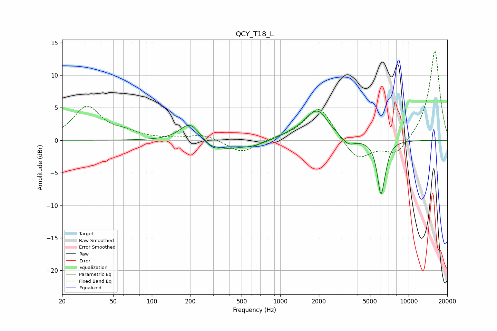

# QCY_T18_L
See [usage instructions](https://github.com/jaakkopasanen/AutoEq#usage) for more options and info.

### Parametric EQs
Apply preamp of -4.6 dB when using parametric equalizer.

|   # | Type    |   Fc (Hz) |    Q |   Gain (dB) |
|-----|---------|-----------|------|-------------|
|   1 | Peaking |       197 | 1.85 |         2.8 |
|   2 | Peaking |       282 | 3.34 |        -0.6 |
|   3 | Peaking |       366 | 1.2  |        -1.3 |
|   4 | Peaking |       613 | 1.36 |        -0.8 |
|   5 | Peaking |      1203 | 1.5  |         0.4 |
|   6 | Peaking |      1897 | 1.52 |         4.3 |
|   7 | Peaking |      2102 | 4.2  |         0.4 |
|   8 | Peaking |      3383 | 2.73 |        -1.3 |
|   9 | Peaking |      6083 | 4.79 |        -8   |
|  10 | Peaking |      6633 | 5.46 |        -0.9 |

### Fixed Band EQs
When using fixed band (also called graphic) equalizer, apply preamp of **-13.8 dB** (if available) and set gains manually with these parameters.

|   # | Type    |   Fc (Hz) |    Q |   Gain (dB) |
|-----|---------|-----------|------|-------------|
|   1 | Peaking |        31 | 1.41 |         5.1 |
|   2 | Peaking |        62 | 1.41 |         0.9 |
|   3 | Peaking |       125 | 1.41 |         0.1 |
|   4 | Peaking |       250 | 1.41 |         0.9 |
|   5 | Peaking |       500 | 1.41 |        -2   |
|   6 | Peaking |      1000 | 1.41 |         0.2 |
|   7 | Peaking |      2000 | 1.41 |         5.3 |
|   8 | Peaking |      4000 | 1.41 |        -3.3 |
|   9 | Peaking |      8000 | 1.41 |        -2.4 |
|  10 | Peaking |     16000 | 1.41 |        13.9 |

### Graphs

