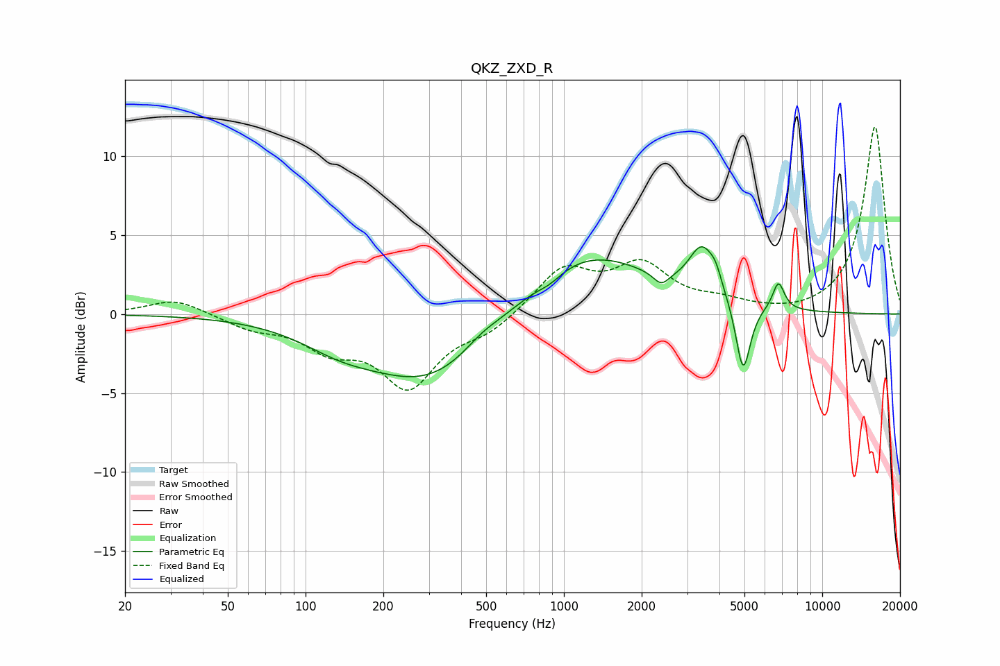

# QKZ_ZXD_R
See [usage instructions](https://github.com/jaakkopasanen/AutoEq#usage) for more options and info.

### Parametric EQs
Apply preamp of -4.3 dB when using parametric equalizer.

|   # | Type    |   Fc (Hz) |    Q |   Gain (dB) |
|-----|---------|-----------|------|-------------|
|   1 | Peaking |       135 | 0.93 |        -1.1 |
|   2 | Peaking |       309 | 0.58 |        -4.4 |
|   3 | Peaking |       481 | 1.92 |         0.6 |
|   4 | Peaking |       882 | 2.99 |        -0.4 |
|   5 | Peaking |      1199 | 0.56 |         4.1 |
|   6 | Peaking |      2381 | 4.8  |        -0.8 |
|   7 | Peaking |      3426 | 2.75 |         3.1 |
|   8 | Peaking |      3867 | 6    |         0.8 |
|   9 | Peaking |      4939 | 4.93 |        -4.6 |
|  10 | Peaking |      6771 | 5.98 |         1.8 |

### Fixed Band EQs
When using fixed band (also called graphic) equalizer, apply preamp of **-11.9 dB** (if available) and set gains manually with these parameters.

|   # | Type    |   Fc (Hz) |    Q |   Gain (dB) |
|-----|---------|-----------|------|-------------|
|   1 | Peaking |        31 | 1.41 |         1   |
|   2 | Peaking |        62 | 1.41 |        -0.8 |
|   3 | Peaking |       125 | 1.41 |        -1.9 |
|   4 | Peaking |       250 | 1.41 |        -4.4 |
|   5 | Peaking |       500 | 1.41 |        -1   |
|   6 | Peaking |      1000 | 1.41 |         2.8 |
|   7 | Peaking |      2000 | 1.41 |         2.9 |
|   8 | Peaking |      4000 | 1.41 |         0.6 |
|   9 | Peaking |      8000 | 1.41 |        -0.1 |
|  10 | Peaking |     16000 | 1.41 |        11.9 |

### Graphs

