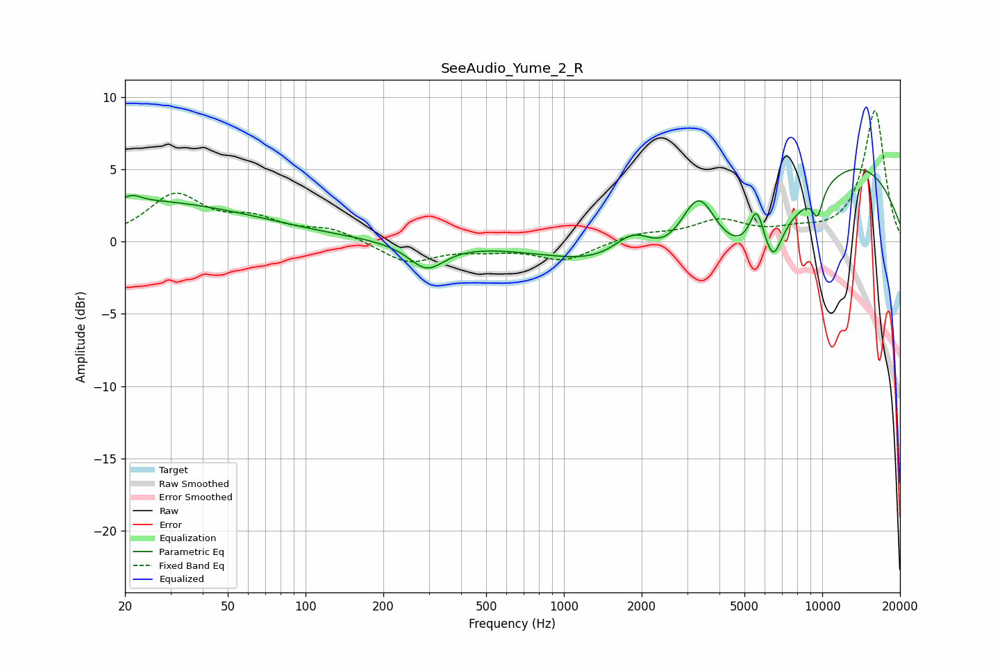

# SeeAudio_Yume_2_R
See [usage instructions](https://github.com/jaakkopasanen/AutoEq#usage) for more options and info.

### Parametric EQs
Apply preamp of -5.1 dB when using parametric equalizer.

|   # | Type    |   Fc (Hz) |    Q |   Gain (dB) |
|-----|---------|-----------|------|-------------|
|   1 | Peaking |        21 | 0.28 |         2.9 |
|   2 | Peaking |        22 | 4.83 |         0.4 |
|   3 | Peaking |       294 | 2.05 |        -1.8 |
|   4 | Peaking |      1865 | 1.7  |         2.4 |
|   5 | Peaking |      3322 | 1.84 |         5.5 |
|   6 | Peaking |      4951 | 0.35 |        -9   |
|   7 | Peaking |      5568 | 5.06 |         2.5 |
|   8 | Peaking |      6462 | 4.19 |        -2.1 |
|   9 | Peaking |      9593 | 6    |        -1.8 |
|  10 | Peaking |      9675 | 0.31 |         9.9 |

### Fixed Band EQs
When using fixed band (also called graphic) equalizer, apply preamp of **-9.2 dB** (if available) and set gains manually with these parameters.

|   # | Type    |   Fc (Hz) |    Q |   Gain (dB) |
|-----|---------|-----------|------|-------------|
|   1 | Peaking |        31 | 1.41 |         3.1 |
|   2 | Peaking |        62 | 1.41 |         1.3 |
|   3 | Peaking |       125 | 1.41 |         0.8 |
|   4 | Peaking |       250 | 1.41 |        -1.5 |
|   5 | Peaking |       500 | 1.41 |        -0.4 |
|   6 | Peaking |      1000 | 1.41 |        -1.3 |
|   7 | Peaking |      2000 | 1.41 |         0.5 |
|   8 | Peaking |      4000 | 1.41 |         1.4 |
|   9 | Peaking |      8000 | 1.41 |         0.5 |
|  10 | Peaking |     16000 | 1.41 |         9.1 |

### Graphs

