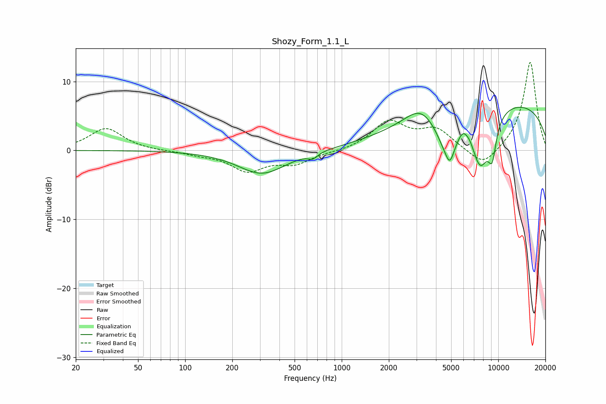

# Shozy_Form_1.1_L
See [usage instructions](https://github.com/jaakkopasanen/AutoEq#usage) for more options and info.

### Parametric EQs
Apply preamp of -6.4 dB when using parametric equalizer.

|   # | Type    |   Fc (Hz) |    Q |   Gain (dB) |
|-----|---------|-----------|------|-------------|
|   1 | Peaking |       310 | 0.93 |        -3.4 |
|   2 | Peaking |       655 | 4.8  |        -0.8 |
|   3 | Peaking |      3194 | 1.47 |         2.5 |
|   4 | Peaking |      4720 | 1.88 |        -5.5 |
|   5 | Peaking |      4907 | 5.63 |        -2.1 |
|   6 | Peaking |      5953 | 4.58 |         1.3 |
|   7 | Peaking |      6569 | 6    |         0.5 |
|   8 | Peaking |      7683 | 2.17 |        -7.9 |
|   9 | Peaking |      9149 | 4.82 |        -4.7 |
|  10 | Peaking |      9889 | 0.2  |         7.3 |

### Fixed Band EQs
When using fixed band (also called graphic) equalizer, apply preamp of **-12.9 dB** (if available) and set gains manually with these parameters.

|   # | Type    |   Fc (Hz) |    Q |   Gain (dB) |
|-----|---------|-----------|------|-------------|
|   1 | Peaking |        31 | 1.41 |         3.2 |
|   2 | Peaking |        62 | 1.41 |        -0.1 |
|   3 | Peaking |       125 | 1.41 |        -0.5 |
|   4 | Peaking |       250 | 1.41 |        -2.8 |
|   5 | Peaking |       500 | 1.41 |        -1.8 |
|   6 | Peaking |      1000 | 1.41 |        -0.2 |
|   7 | Peaking |      2000 | 1.41 |         4   |
|   8 | Peaking |      4000 | 1.41 |         2.8 |
|   9 | Peaking |      8000 | 1.41 |        -2.7 |
|  10 | Peaking |     16000 | 1.41 |        12.9 |

### Graphs

