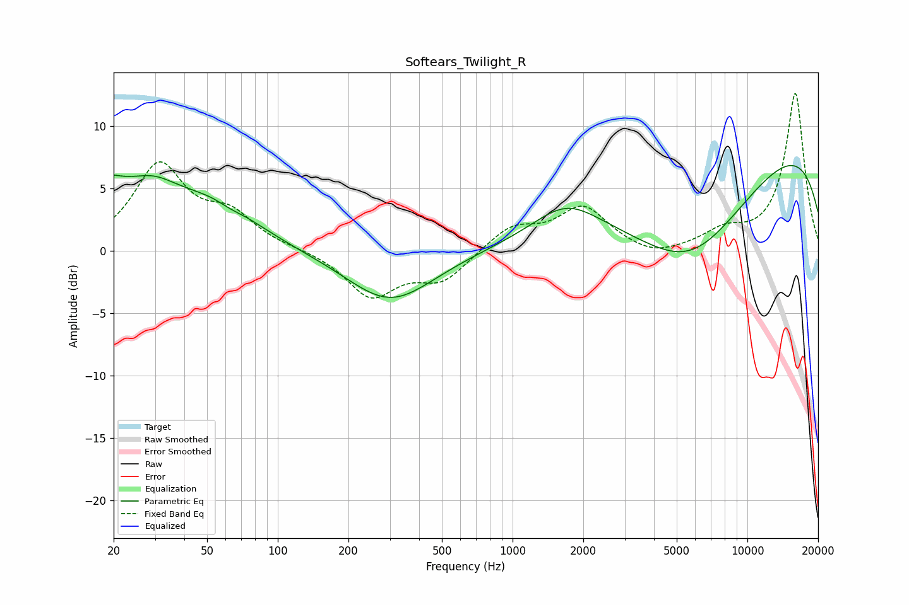

# Softears_Twilight_R
See [usage instructions](https://github.com/jaakkopasanen/AutoEq#usage) for more options and info.

### Parametric EQs
Apply preamp of -6.9 dB when using parametric equalizer.

|   # | Type    |   Fc (Hz) |    Q |   Gain (dB) |
|-----|---------|-----------|------|-------------|
|   1 | Peaking |        20 | 5.1  |         3.3 |
|   2 | Peaking |        20 | 5.45 |        -2.6 |
|   3 | Peaking |        24 | 0.42 |         5.3 |
|   4 | Peaking |        30 | 1.9  |         0.6 |
|   5 | Peaking |        61 | 1.28 |         1.6 |
|   6 | Peaking |        62 | 2.15 |        -0.8 |
|   7 | Peaking |       301 | 0.76 |        -4.2 |
|   8 | Peaking |      1687 | 1.03 |         2.5 |
|   9 | Peaking |      5681 | 0.48 |        -9.6 |
|  10 | Peaking |      9620 | 0.19 |        10.2 |

### Fixed Band EQs
When using fixed band (also called graphic) equalizer, apply preamp of **-12.7 dB** (if available) and set gains manually with these parameters.

|   # | Type    |   Fc (Hz) |    Q |   Gain (dB) |
|-----|---------|-----------|------|-------------|
|   1 | Peaking |        31 | 1.41 |         6.7 |
|   2 | Peaking |        62 | 1.41 |         2.5 |
|   3 | Peaking |       125 | 1.41 |         0.1 |
|   4 | Peaking |       250 | 1.41 |        -3.6 |
|   5 | Peaking |       500 | 1.41 |        -2.3 |
|   6 | Peaking |      1000 | 1.41 |         1.9 |
|   7 | Peaking |      2000 | 1.41 |         3.4 |
|   8 | Peaking |      4000 | 1.41 |        -0.7 |
|   9 | Peaking |      8000 | 1.41 |         1.3 |
|  10 | Peaking |     16000 | 1.41 |        12.6 |

### Graphs

