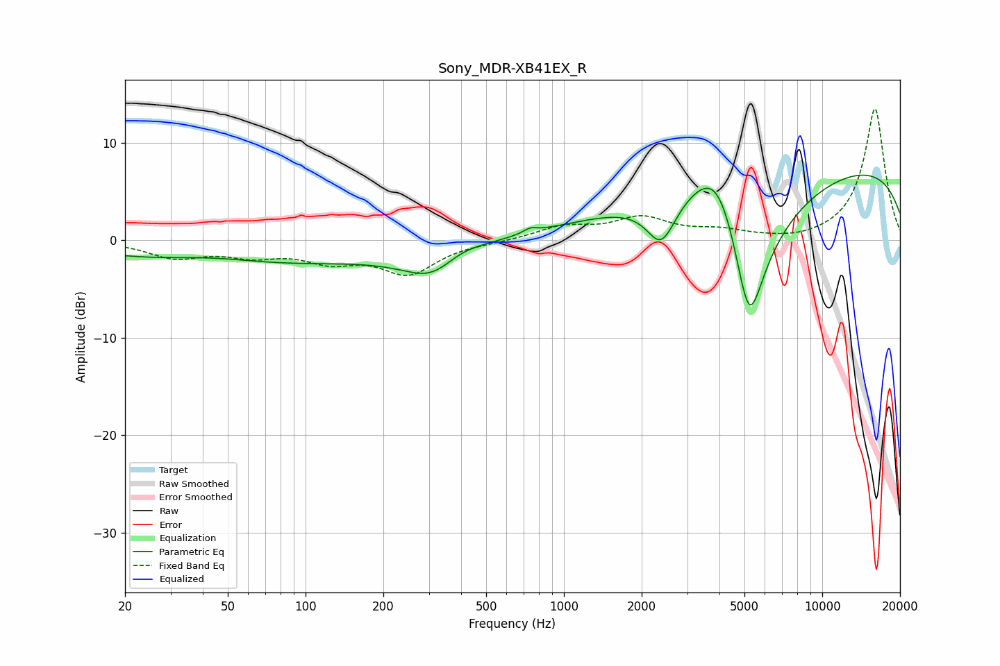

# Sony_MDR-XB41EX_R
See [usage instructions](https://github.com/jaakkopasanen/AutoEq#usage) for more options and info.

### Parametric EQs
Apply preamp of -6.8 dB when using parametric equalizer.

|   # | Type    |   Fc (Hz) |    Q |   Gain (dB) |
|-----|---------|-----------|------|-------------|
|   1 | Peaking |        43 | 0.76 |         0.9 |
|   2 | Peaking |        89 | 0.19 |        -3.2 |
|   3 | Peaking |       315 | 1.25 |        -3.2 |
|   4 | Peaking |       389 | 1.51 |         1.4 |
|   5 | Peaking |       497 | 0.18 |         1.3 |
|   6 | Peaking |       741 | 5.47 |         0.5 |
|   7 | Peaking |      2381 | 2.51 |        -4.6 |
|   8 | Peaking |      3995 | 1.22 |         9.3 |
|   9 | Peaking |      5204 | 1.41 |       -20   |
|  10 | Peaking |      9886 | 0.18 |         8.2 |

### Fixed Band EQs
When using fixed band (also called graphic) equalizer, apply preamp of **-13.6 dB** (if available) and set gains manually with these parameters.

|   # | Type    |   Fc (Hz) |    Q |   Gain (dB) |
|-----|---------|-----------|------|-------------|
|   1 | Peaking |        31 | 1.41 |        -1.6 |
|   2 | Peaking |        62 | 1.41 |        -1.3 |
|   3 | Peaking |       125 | 1.41 |        -1.8 |
|   4 | Peaking |       250 | 1.41 |        -3.3 |
|   5 | Peaking |       500 | 1.41 |        -0.1 |
|   6 | Peaking |      1000 | 1.41 |         1.3 |
|   7 | Peaking |      2000 | 1.41 |         2.1 |
|   8 | Peaking |      4000 | 1.41 |         0.8 |
|   9 | Peaking |      8000 | 1.41 |        -0.3 |
|  10 | Peaking |     16000 | 1.41 |        13.6 |

### Graphs

