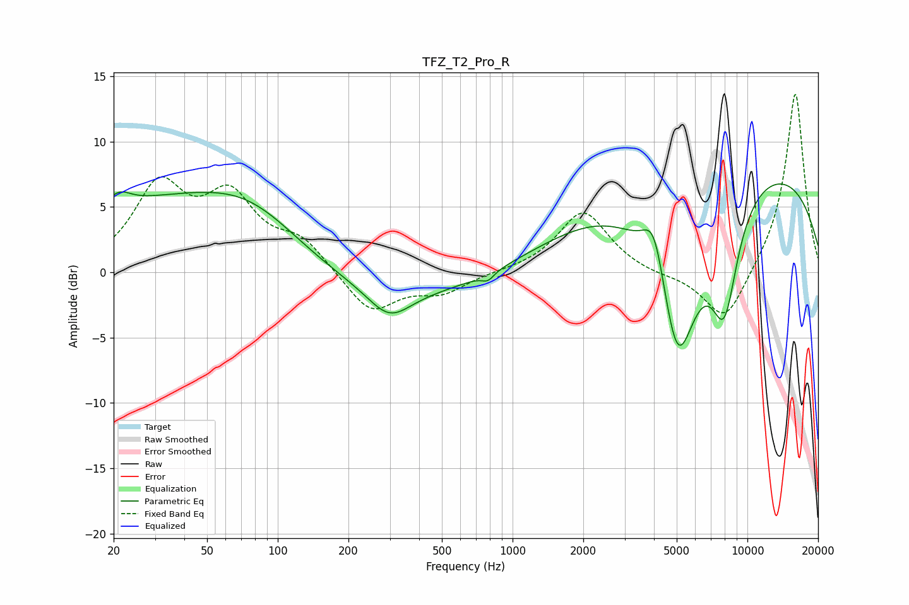

# TFZ_T2_Pro_R
See [usage instructions](https://github.com/jaakkopasanen/AutoEq#usage) for more options and info.

### Parametric EQs
Apply preamp of -6.9 dB when using parametric equalizer.

|   # | Type    |   Fc (Hz) |    Q |   Gain (dB) |
|-----|---------|-----------|------|-------------|
|   1 | Peaking |        21 | 2.72 |         1.3 |
|   2 | Peaking |        28 | 0.4  |         4.4 |
|   3 | Peaking |        78 | 0.6  |         4.3 |
|   4 | Peaking |       299 | 1.55 |        -2.3 |
|   5 | Peaking |       304 | 0.25 |        -2.2 |
|   6 | Peaking |       786 | 5.41 |        -0.6 |
|   7 | Peaking |      4014 | 2.84 |         4.4 |
|   8 | Peaking |      5034 | 1.39 |       -14.3 |
|   9 | Peaking |      7933 | 0.18 |         9.1 |
|  10 | Peaking |      7975 | 2.22 |        -8   |

### Fixed Band EQs
When using fixed band (also called graphic) equalizer, apply preamp of **-13.7 dB** (if available) and set gains manually with these parameters.

|   # | Type    |   Fc (Hz) |    Q |   Gain (dB) |
|-----|---------|-----------|------|-------------|
|   1 | Peaking |        31 | 1.41 |         6.3 |
|   2 | Peaking |        62 | 1.41 |         5.2 |
|   3 | Peaking |       125 | 1.41 |         2.2 |
|   4 | Peaking |       250 | 1.41 |        -3.2 |
|   5 | Peaking |       500 | 1.41 |        -1.5 |
|   6 | Peaking |      1000 | 1.41 |         0.1 |
|   7 | Peaking |      2000 | 1.41 |         4.7 |
|   8 | Peaking |      4000 | 1.41 |        -0.3 |
|   9 | Peaking |      8000 | 1.41 |        -4.1 |
|  10 | Peaking |     16000 | 1.41 |        13.9 |

### Graphs

