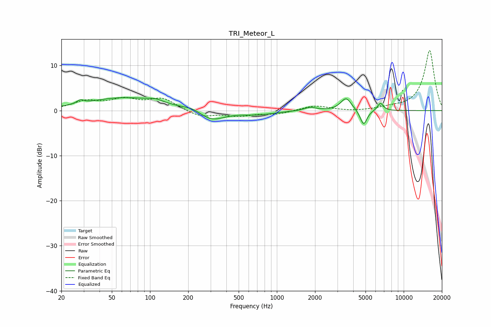

# TRI_Meteor_L
See [usage instructions](https://github.com/jaakkopasanen/AutoEq#usage) for more options and info.

### Parametric EQs
Apply preamp of -3.0 dB when using parametric equalizer.

|   # | Type    |   Fc (Hz) |    Q |   Gain (dB) |
|-----|---------|-----------|------|-------------|
|   1 | Peaking |        28 | 5.41 |         0.8 |
|   2 | Peaking |        62 | 0.5  |         2.8 |
|   3 | Peaking |       111 | 2.27 |         0.7 |
|   4 | Peaking |       220 | 1.68 |         0.9 |
|   5 | Peaking |       302 | 1.34 |        -2.5 |
|   6 | Peaking |       711 | 1.11 |        -0.8 |
|   7 | Peaking |      1831 | 3.12 |         0.8 |
|   8 | Peaking |      3515 | 3.35 |         2.8 |
|   9 | Peaking |      4829 | 5.13 |        -3.4 |
|  10 | Peaking |      6550 | 5.96 |         1.7 |

### Fixed Band EQs
When using fixed band (also called graphic) equalizer, apply preamp of **-13.4 dB** (if available) and set gains manually with these parameters.

|   # | Type    |   Fc (Hz) |    Q |   Gain (dB) |
|-----|---------|-----------|------|-------------|
|   1 | Peaking |        31 | 1.41 |         1.9 |
|   2 | Peaking |        62 | 1.41 |         2.2 |
|   3 | Peaking |       125 | 1.41 |         2.6 |
|   4 | Peaking |       250 | 1.41 |        -1.4 |
|   5 | Peaking |       500 | 1.41 |        -1.1 |
|   6 | Peaking |      1000 | 1.41 |        -0.7 |
|   7 | Peaking |      2000 | 1.41 |         1.1 |
|   8 | Peaking |      4000 | 1.41 |        -0.2 |
|   9 | Peaking |      8000 | 1.41 |         0.5 |
|  10 | Peaking |     16000 | 1.41 |        13.4 |

### Graphs

