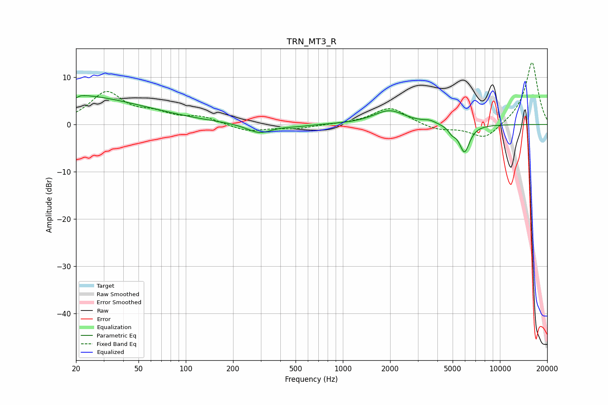

# TRN_MT3_R
See [usage instructions](https://github.com/jaakkopasanen/AutoEq#usage) for more options and info.

### Parametric EQs
Apply preamp of -6.2 dB when using parametric equalizer.

|   # | Type    |   Fc (Hz) |    Q |   Gain (dB) |
|-----|---------|-----------|------|-------------|
|   1 | Peaking |        20 | 0.73 |         1.2 |
|   2 | Peaking |        20 | 5.98 |        -3.9 |
|   3 | Peaking |        20 | 5.64 |         3.4 |
|   4 | Peaking |        23 | 0.31 |         4.9 |
|   5 | Peaking |       295 | 1.79 |        -2   |
|   6 | Peaking |       511 | 1.62 |        -0.3 |
|   7 | Peaking |      1978 | 1.42 |         3   |
|   8 | Peaking |      3577 | 3.64 |         0.6 |
|   9 | Peaking |      4955 | 5.68 |        -1.2 |
|  10 | Peaking |      5950 | 4.11 |        -5.8 |

### Fixed Band EQs
When using fixed band (also called graphic) equalizer, apply preamp of **-13.2 dB** (if available) and set gains manually with these parameters.

|   # | Type    |   Fc (Hz) |    Q |   Gain (dB) |
|-----|---------|-----------|------|-------------|
|   1 | Peaking |        31 | 1.41 |         6.6 |
|   2 | Peaking |        62 | 1.41 |         1.9 |
|   3 | Peaking |       125 | 1.41 |         1.4 |
|   4 | Peaking |       250 | 1.41 |        -1.5 |
|   5 | Peaking |       500 | 1.41 |        -0.8 |
|   6 | Peaking |      1000 | 1.41 |         0.1 |
|   7 | Peaking |      2000 | 1.41 |         3.6 |
|   8 | Peaking |      4000 | 1.41 |        -1.2 |
|   9 | Peaking |      8000 | 1.41 |        -3.3 |
|  10 | Peaking |     16000 | 1.41 |        13.4 |

### Graphs

