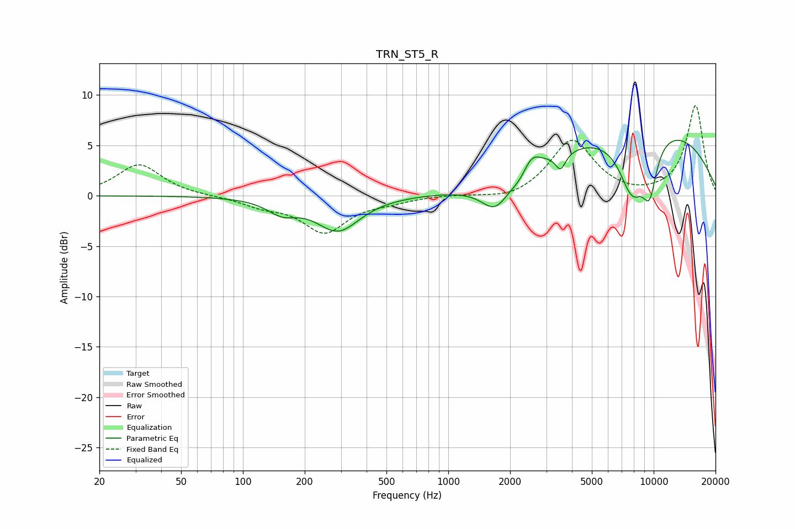

# TRN_ST5_R
See [usage instructions](https://github.com/jaakkopasanen/AutoEq#usage) for more options and info.

### Parametric EQs
Apply preamp of -5.6 dB when using parametric equalizer.

|   # | Type    |   Fc (Hz) |    Q |   Gain (dB) |
|-----|---------|-----------|------|-------------|
|   1 | Peaking |       155 | 1.96 |        -1.3 |
|   2 | Peaking |       290 | 1.34 |        -3.4 |
|   3 | Peaking |      1434 | 1.07 |        -0.3 |
|   4 | Peaking |      1694 | 2.14 |        -2.7 |
|   5 | Peaking |      2257 | 3.02 |        -0.9 |
|   6 | Peaking |      2530 | 3.17 |         1.8 |
|   7 | Peaking |      3519 | 5.72 |        -1.7 |
|   8 | Peaking |      7872 | 1.93 |        -6.1 |
|   9 | Peaking |      8879 | 0.28 |         7.3 |
|  10 | Peaking |      9560 | 3.51 |        -4.5 |

### Fixed Band EQs
When using fixed band (also called graphic) equalizer, apply preamp of **-9.0 dB** (if available) and set gains manually with these parameters.

|   # | Type    |   Fc (Hz) |    Q |   Gain (dB) |
|-----|---------|-----------|------|-------------|
|   1 | Peaking |        31 | 1.41 |         3.1 |
|   2 | Peaking |        62 | 1.41 |        -0   |
|   3 | Peaking |       125 | 1.41 |        -0.9 |
|   4 | Peaking |       250 | 1.41 |        -3.5 |
|   5 | Peaking |       500 | 1.41 |        -0.5 |
|   6 | Peaking |      1000 | 1.41 |         0.1 |
|   7 | Peaking |      2000 | 1.41 |        -0.6 |
|   8 | Peaking |      4000 | 1.41 |         5.5 |
|   9 | Peaking |      8000 | 1.41 |        -0.2 |
|  10 | Peaking |     16000 | 1.41 |         9   |

### Graphs

