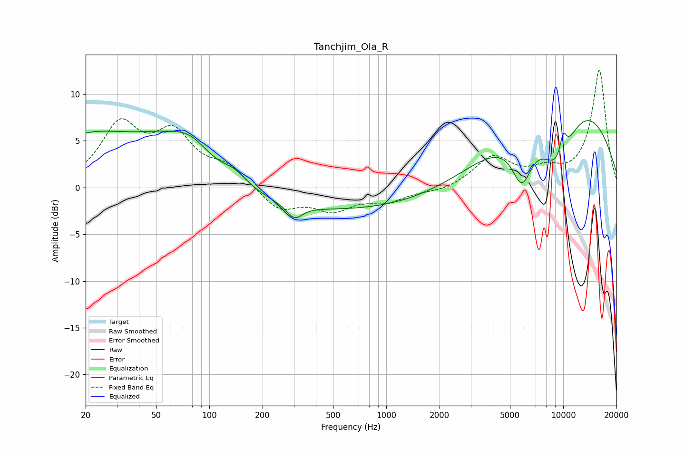

# Tanchjim_Ola_R
See [usage instructions](https://github.com/jaakkopasanen/AutoEq#usage) for more options and info.

### Parametric EQs
Apply preamp of -7.3 dB when using parametric equalizer.

|   # | Type    |   Fc (Hz) |    Q |   Gain (dB) |
|-----|---------|-----------|------|-------------|
|   1 | Peaking |        20 | 0.53 |         4.9 |
|   2 | Peaking |        61 | 0.65 |         3.9 |
|   3 | Peaking |        80 | 1.48 |         1.6 |
|   4 | Peaking |       140 | 2.09 |         1.2 |
|   5 | Peaking |       302 | 3.15 |        -1.5 |
|   6 | Peaking |       689 | 0.18 |        -2.6 |
|   7 | Peaking |      5836 | 2.37 |        -5.1 |
|   8 | Peaking |      9276 | 1.14 |        -7.8 |
|   9 | Peaking |      9859 | 0.33 |        11.4 |
|  10 | Peaking |     10000 | 6    |         2.4 |

### Fixed Band EQs
When using fixed band (also called graphic) equalizer, apply preamp of **-12.6 dB** (if available) and set gains manually with these parameters.

|   # | Type    |   Fc (Hz) |    Q |   Gain (dB) |
|-----|---------|-----------|------|-------------|
|   1 | Peaking |        31 | 1.41 |         6.3 |
|   2 | Peaking |        62 | 1.41 |         5.1 |
|   3 | Peaking |       125 | 1.41 |         2   |
|   4 | Peaking |       250 | 1.41 |        -2.4 |
|   5 | Peaking |       500 | 1.41 |        -2.2 |
|   6 | Peaking |      1000 | 1.41 |        -1.3 |
|   7 | Peaking |      2000 | 1.41 |        -0.5 |
|   8 | Peaking |      4000 | 1.41 |         3.2 |
|   9 | Peaking |      8000 | 1.41 |         1.5 |
|  10 | Peaking |     16000 | 1.41 |        12.5 |

### Graphs

