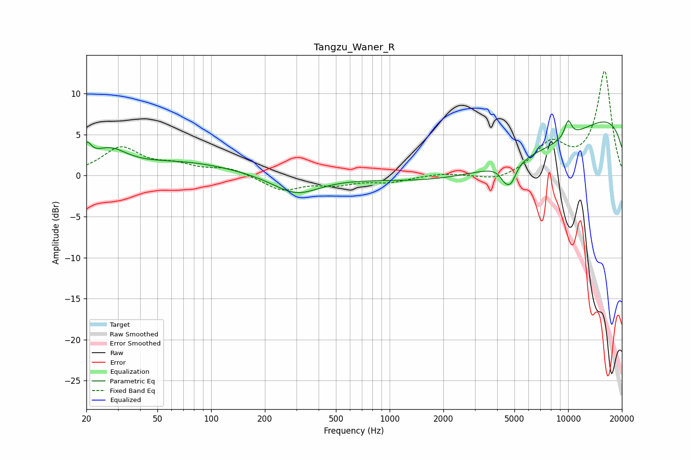

# Tangzu_Waner_R
See [usage instructions](https://github.com/jaakkopasanen/AutoEq#usage) for more options and info.

### Parametric EQs
Apply preamp of -6.8 dB when using parametric equalizer.

|   # | Type    |   Fc (Hz) |    Q |   Gain (dB) |
|-----|---------|-----------|------|-------------|
|   1 | Peaking |        20 | 5.57 |         2.1 |
|   2 | Peaking |        27 | 1.44 |         2.5 |
|   3 | Peaking |        70 | 0.49 |         1.6 |
|   4 | Peaking |       299 | 1.08 |        -2.3 |
|   5 | Peaking |      4419 | 4.81 |        -1.3 |
|   6 | Peaking |      4796 | 4.59 |        -2   |
|   7 | Peaking |      5220 | 0.27 |        -7.2 |
|   8 | Peaking |     10000 | 0.18 |        10.5 |
|   9 | Peaking |     10000 | 5.87 |         0.7 |
|  10 | Peaking |     10000 | 6    |         1.4 |

### Fixed Band EQs
When using fixed band (also called graphic) equalizer, apply preamp of **-12.8 dB** (if available) and set gains manually with these parameters.

|   # | Type    |   Fc (Hz) |    Q |   Gain (dB) |
|-----|---------|-----------|------|-------------|
|   1 | Peaking |        31 | 1.41 |         3.3 |
|   2 | Peaking |        62 | 1.41 |         1.1 |
|   3 | Peaking |       125 | 1.41 |         0.9 |
|   4 | Peaking |       250 | 1.41 |        -1.8 |
|   5 | Peaking |       500 | 1.41 |        -0.9 |
|   6 | Peaking |      1000 | 1.41 |        -0.7 |
|   7 | Peaking |      2000 | 1.41 |         0.3 |
|   8 | Peaking |      4000 | 1.41 |        -0.8 |
|   9 | Peaking |      8000 | 1.41 |         3.7 |
|  10 | Peaking |     16000 | 1.41 |        12.7 |

### Graphs

