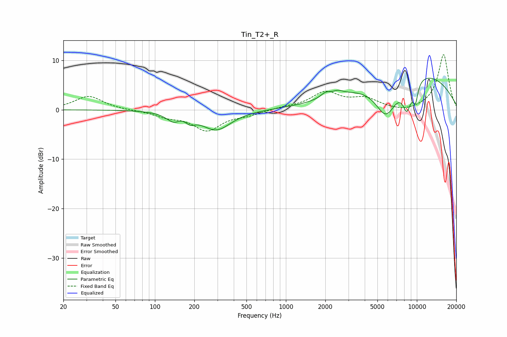

# Tin_T2+_R
See [usage instructions](https://github.com/jaakkopasanen/AutoEq#usage) for more options and info.

### Parametric EQs
Apply preamp of -6.5 dB when using parametric equalizer.

|   # | Type    |   Fc (Hz) |    Q |   Gain (dB) |
|-----|---------|-----------|------|-------------|
|   1 | Peaking |       143 | 2.46 |        -2.3 |
|   2 | Peaking |       155 | 3.44 |         1   |
|   3 | Peaking |       186 | 4.04 |        -1.1 |
|   4 | Peaking |       295 | 1.26 |        -4   |
|   5 | Peaking |      2015 | 3.62 |         1.1 |
|   6 | Peaking |      2496 | 3.49 |         0.8 |
|   7 | Peaking |      5816 | 1.57 |        -7.7 |
|   8 | Peaking |      8399 | 3.92 |        -5.2 |
|   9 | Peaking |      8887 | 0.29 |         8.1 |
|  10 | Peaking |      9744 | 5.98 |        -3.9 |

### Fixed Band EQs
When using fixed band (also called graphic) equalizer, apply preamp of **-11.3 dB** (if available) and set gains manually with these parameters.

|   # | Type    |   Fc (Hz) |    Q |   Gain (dB) |
|-----|---------|-----------|------|-------------|
|   1 | Peaking |        31 | 1.41 |         2.8 |
|   2 | Peaking |        62 | 1.41 |        -0.1 |
|   3 | Peaking |       125 | 1.41 |        -1.2 |
|   4 | Peaking |       250 | 1.41 |        -4   |
|   5 | Peaking |       500 | 1.41 |        -0.9 |
|   6 | Peaking |      1000 | 1.41 |         0.4 |
|   7 | Peaking |      2000 | 1.41 |         3.4 |
|   8 | Peaking |      4000 | 1.41 |         2   |
|   9 | Peaking |      8000 | 1.41 |        -0.6 |
|  10 | Peaking |     16000 | 1.41 |        11.2 |

### Graphs

