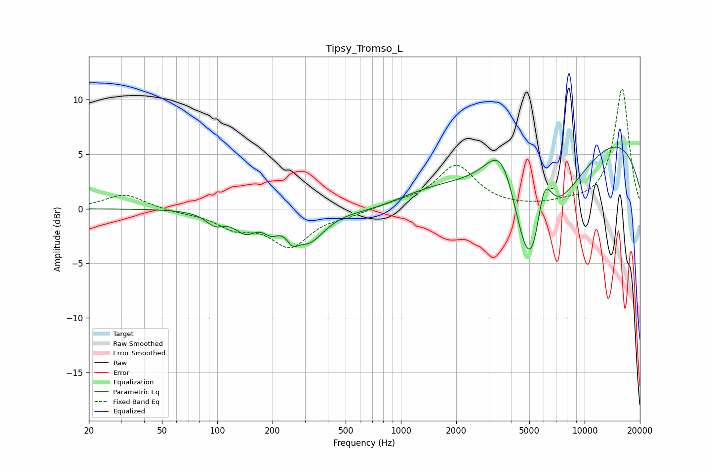

# Tipsy_Tromso_L
See [usage instructions](https://github.com/jaakkopasanen/AutoEq#usage) for more options and info.

### Parametric EQs
Apply preamp of -5.7 dB when using parametric equalizer.

|   # | Type    |   Fc (Hz) |    Q |   Gain (dB) |
|-----|---------|-----------|------|-------------|
|   1 | Peaking |        97 | 2.83 |        -1.1 |
|   2 | Peaking |       142 | 2.35 |        -1.7 |
|   3 | Peaking |       196 | 3.5  |        -1   |
|   4 | Peaking |       257 | 4.86 |        -1   |
|   5 | Peaking |       313 | 1.59 |        -2.9 |
|   6 | Peaking |       729 | 0.85 |        -0.7 |
|   7 | Peaking |      3583 | 1.39 |         7.4 |
|   8 | Peaking |      5138 | 0.85 |       -20   |
|   9 | Peaking |      5997 | 2.75 |         7   |
|  10 | Peaking |      7603 | 0.18 |         9.8 |

### Fixed Band EQs
When using fixed band (also called graphic) equalizer, apply preamp of **-11.1 dB** (if available) and set gains manually with these parameters.

|   # | Type    |   Fc (Hz) |    Q |   Gain (dB) |
|-----|---------|-----------|------|-------------|
|   1 | Peaking |        31 | 1.41 |         1.4 |
|   2 | Peaking |        62 | 1.41 |        -0.3 |
|   3 | Peaking |       125 | 1.41 |        -1.5 |
|   4 | Peaking |       250 | 1.41 |        -3.3 |
|   5 | Peaking |       500 | 1.41 |        -0.5 |
|   6 | Peaking |      1000 | 1.41 |         0.4 |
|   7 | Peaking |      2000 | 1.41 |         3.9 |
|   8 | Peaking |      4000 | 1.41 |         0   |
|   9 | Peaking |      8000 | 1.41 |         0.3 |
|  10 | Peaking |     16000 | 1.41 |        11   |

### Graphs

