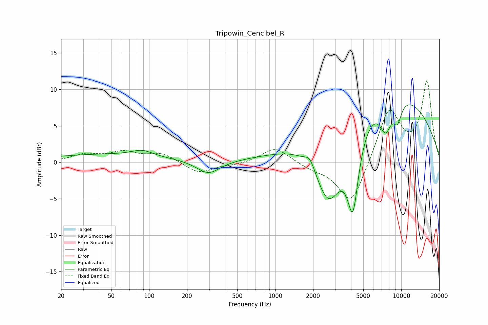

# Tripowin_Cencibel_R
See [usage instructions](https://github.com/jaakkopasanen/AutoEq#usage) for more options and info.

### Parametric EQs
Apply preamp of -8.0 dB when using parametric equalizer.

|   # | Type    |   Fc (Hz) |    Q |   Gain (dB) |
|-----|---------|-----------|------|-------------|
|   1 | Peaking |        45 | 0.3  |         1.1 |
|   2 | Peaking |        88 | 1.75 |         0.8 |
|   3 | Peaking |       295 | 1.54 |        -1.9 |
|   4 | Peaking |      1619 | 1.22 |         0.5 |
|   5 | Peaking |      1890 | 3.57 |         1.6 |
|   6 | Peaking |      2665 | 1.07 |       -11.8 |
|   7 | Peaking |      4139 | 2.96 |       -10.6 |
|   8 | Peaking |      6721 | 0.24 |        10.8 |
|   9 | Peaking |      7507 | 2.8  |        -4.1 |
|  10 | Peaking |      9330 | 3.68 |        -2.8 |

### Fixed Band EQs
When using fixed band (also called graphic) equalizer, apply preamp of **-11.3 dB** (if available) and set gains manually with these parameters.

|   # | Type    |   Fc (Hz) |    Q |   Gain (dB) |
|-----|---------|-----------|------|-------------|
|   1 | Peaking |        31 | 1.41 |         1   |
|   2 | Peaking |        62 | 1.41 |         1.3 |
|   3 | Peaking |       125 | 1.41 |         1.2 |
|   4 | Peaking |       250 | 1.41 |        -1.5 |
|   5 | Peaking |       500 | 1.41 |        -0.3 |
|   6 | Peaking |      1000 | 1.41 |         2.1 |
|   7 | Peaking |      2000 | 1.41 |        -0.7 |
|   8 | Peaking |      4000 | 1.41 |        -6.1 |
|   9 | Peaking |      8000 | 1.41 |         7.3 |
|  10 | Peaking |     16000 | 1.41 |        10.9 |

### Graphs

