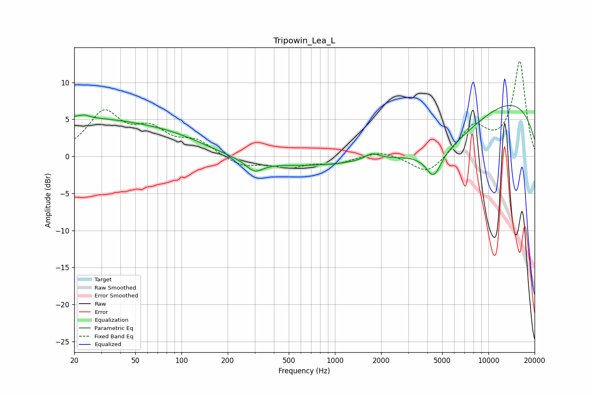

# Tripowin_Lea_L
See [usage instructions](https://github.com/jaakkopasanen/AutoEq#usage) for more options and info.

### Parametric EQs
Apply preamp of -7.0 dB when using parametric equalizer.

|   # | Type    |   Fc (Hz) |    Q |   Gain (dB) |
|-----|---------|-----------|------|-------------|
|   1 | Peaking |        21 | 0.25 |         5   |
|   2 | Peaking |        22 | 5.74 |        -3.1 |
|   3 | Peaking |        22 | 5.29 |         3.5 |
|   4 | Peaking |       103 | 0.61 |         1.1 |
|   5 | Peaking |       299 | 2.61 |        -1.5 |
|   6 | Peaking |       843 | 0.18 |        -1.6 |
|   7 | Peaking |      1744 | 3.05 |         0.9 |
|   8 | Peaking |      4402 | 2.86 |        -3.3 |
|   9 | Peaking |      5193 | 0.5  |        -5.3 |
|  10 | Peaking |     10000 | 0.23 |         8.9 |

### Fixed Band EQs
When using fixed band (also called graphic) equalizer, apply preamp of **-12.9 dB** (if available) and set gains manually with these parameters.

|   # | Type    |   Fc (Hz) |    Q |   Gain (dB) |
|-----|---------|-----------|------|-------------|
|   1 | Peaking |        31 | 1.41 |         5.7 |
|   2 | Peaking |        62 | 1.41 |         3.1 |
|   3 | Peaking |       125 | 1.41 |         1.9 |
|   4 | Peaking |       250 | 1.41 |        -1.4 |
|   5 | Peaking |       500 | 1.41 |        -1.3 |
|   6 | Peaking |      1000 | 1.41 |        -0.9 |
|   7 | Peaking |      2000 | 1.41 |         0.9 |
|   8 | Peaking |      4000 | 1.41 |        -2.6 |
|   9 | Peaking |      8000 | 1.41 |         3.9 |
|  10 | Peaking |     16000 | 1.41 |        12.8 |

### Graphs

