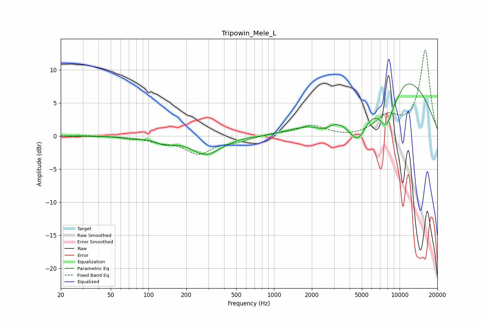

# Tripowin_Mele_L
See [usage instructions](https://github.com/jaakkopasanen/AutoEq#usage) for more options and info.

### Parametric EQs
Apply preamp of -8.0 dB when using parametric equalizer.

|   # | Type    |   Fc (Hz) |    Q |   Gain (dB) |
|-----|---------|-----------|------|-------------|
|   1 | Peaking |        73 | 2.29 |        -0.3 |
|   2 | Peaking |       134 | 2.16 |        -0.8 |
|   3 | Peaking |       288 | 1.19 |        -2.8 |
|   4 | Peaking |       857 | 1.94 |        -0.2 |
|   5 | Peaking |      2483 | 2.18 |        -1.2 |
|   6 | Peaking |      4653 | 1.54 |        -6.5 |
|   7 | Peaking |      7881 | 1.79 |        -7   |
|   8 | Peaking |      8976 | 0.35 |        10.5 |
|   9 | Peaking |      9674 | 5.79 |         2   |
|  10 | Peaking |      9719 | 5.85 |        -2.4 |

### Fixed Band EQs
When using fixed band (also called graphic) equalizer, apply preamp of **-13.1 dB** (if available) and set gains manually with these parameters.

|   # | Type    |   Fc (Hz) |    Q |   Gain (dB) |
|-----|---------|-----------|------|-------------|
|   1 | Peaking |        31 | 1.41 |         0.1 |
|   2 | Peaking |        62 | 1.41 |        -0   |
|   3 | Peaking |       125 | 1.41 |        -0.7 |
|   4 | Peaking |       250 | 1.41 |        -2.5 |
|   5 | Peaking |       500 | 1.41 |        -0.7 |
|   6 | Peaking |      1000 | 1.41 |         0.4 |
|   7 | Peaking |      2000 | 1.41 |         1.5 |
|   8 | Peaking |      4000 | 1.41 |        -0.2 |
|   9 | Peaking |      8000 | 1.41 |         2.7 |
|  10 | Peaking |     16000 | 1.41 |        13   |

### Graphs

