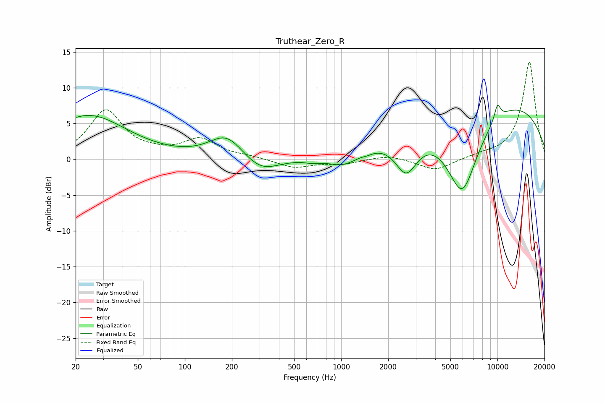

# Truthear_Zero_R
See [usage instructions](https://github.com/jaakkopasanen/AutoEq#usage) for more options and info.

### Parametric EQs
Apply preamp of -7.7 dB when using parametric equalizer.

|   # | Type    |   Fc (Hz) |    Q |   Gain (dB) |
|-----|---------|-----------|------|-------------|
|   1 | Peaking |        24 | 0.58 |         6.1 |
|   2 | Peaking |       185 | 1.29 |         3.4 |
|   3 | Peaking |       304 | 1.23 |        -2.3 |
|   4 | Peaking |       659 | 2.8  |        -0.4 |
|   5 | Peaking |      1040 | 1.39 |        -1.9 |
|   6 | Peaking |      1476 | 4.36 |        -0.3 |
|   7 | Peaking |      2611 | 1.93 |        -5.3 |
|   8 | Peaking |      5949 | 1.21 |       -12.5 |
|   9 | Peaking |      8473 | 0.22 |         9.1 |
|  10 | Peaking |     10000 | 6    |         2.2 |

### Fixed Band EQs
When using fixed band (also called graphic) equalizer, apply preamp of **-13.6 dB** (if available) and set gains manually with these parameters.

|   # | Type    |   Fc (Hz) |    Q |   Gain (dB) |
|-----|---------|-----------|------|-------------|
|   1 | Peaking |        31 | 1.41 |         6.7 |
|   2 | Peaking |        62 | 1.41 |         0.5 |
|   3 | Peaking |       125 | 1.41 |         2.7 |
|   4 | Peaking |       250 | 1.41 |         0.3 |
|   5 | Peaking |       500 | 1.41 |        -1.2 |
|   6 | Peaking |      1000 | 1.41 |        -0.6 |
|   7 | Peaking |      2000 | 1.41 |         0.6 |
|   8 | Peaking |      4000 | 1.41 |        -1.6 |
|   9 | Peaking |      8000 | 1.41 |         0.4 |
|  10 | Peaking |     16000 | 1.41 |        13.6 |

### Graphs

