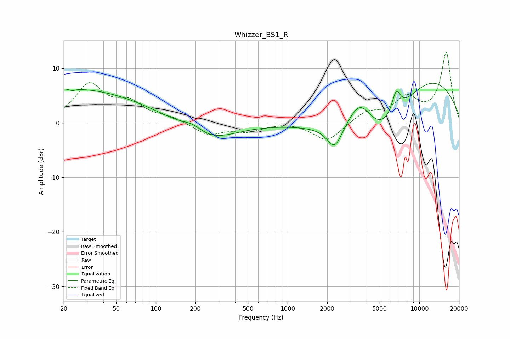

# Whizzer_BS1_R
See [usage instructions](https://github.com/jaakkopasanen/AutoEq#usage) for more options and info.

### Parametric EQs
Apply preamp of -7.3 dB when using parametric equalizer.

|   # | Type    |   Fc (Hz) |    Q |   Gain (dB) |
|-----|---------|-----------|------|-------------|
|   1 | Peaking |        20 | 0.22 |         6.4 |
|   2 | Peaking |        24 | 5.54 |        -2.6 |
|   3 | Peaking |        24 | 5.64 |         2.2 |
|   4 | Peaking |       191 | 1.79 |         1.5 |
|   5 | Peaking |       247 | 0.72 |        -3.5 |
|   6 | Peaking |      2281 | 2.47 |        -4.3 |
|   7 | Peaking |      3550 | 1.44 |         6.6 |
|   8 | Peaking |      5064 | 0.55 |       -10.3 |
|   9 | Peaking |      6671 | 4.06 |         4.3 |
|  10 | Peaking |     10000 | 0.33 |        10.8 |

### Fixed Band EQs
When using fixed band (also called graphic) equalizer, apply preamp of **-13.0 dB** (if available) and set gains manually with these parameters.

|   # | Type    |   Fc (Hz) |    Q |   Gain (dB) |
|-----|---------|-----------|------|-------------|
|   1 | Peaking |        31 | 1.41 |         6.8 |
|   2 | Peaking |        62 | 1.41 |         3.2 |
|   3 | Peaking |       125 | 1.41 |         0.9 |
|   4 | Peaking |       250 | 1.41 |        -2.2 |
|   5 | Peaking |       500 | 1.41 |        -1.4 |
|   6 | Peaking |      1000 | 1.41 |         0.3 |
|   7 | Peaking |      2000 | 1.41 |        -3.5 |
|   8 | Peaking |      4000 | 1.41 |         1.9 |
|   9 | Peaking |      8000 | 1.41 |         4.2 |
|  10 | Peaking |     16000 | 1.41 |        12.8 |

### Graphs

