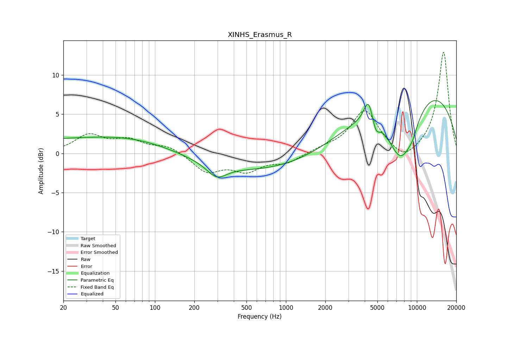

# XINHS_Erasmus_R
See [usage instructions](https://github.com/jaakkopasanen/AutoEq#usage) for more options and info.

### Parametric EQs
Apply preamp of -6.8 dB when using parametric equalizer.

|   # | Type    |   Fc (Hz) |    Q |   Gain (dB) |
|-----|---------|-----------|------|-------------|
|   1 | Peaking |        20 | 0.21 |         1.7 |
|   2 | Peaking |       110 | 0.38 |         1.5 |
|   3 | Peaking |       297 | 1.87 |        -1.7 |
|   4 | Peaking |       605 | 0.19 |        -2.6 |
|   5 | Peaking |      4275 | 3.98 |         3.1 |
|   6 | Peaking |      4856 | 4.63 |        -1.9 |
|   7 | Peaking |      7342 | 1.25 |        -5.7 |
|   8 | Peaking |      8292 | 1.16 |        -3.6 |
|   9 | Peaking |      9329 | 4.26 |        -0.7 |
|  10 | Peaking |      9373 | 0.25 |         9.3 |

### Fixed Band EQs
When using fixed band (also called graphic) equalizer, apply preamp of **-13.0 dB** (if available) and set gains manually with these parameters.

|   # | Type    |   Fc (Hz) |    Q |   Gain (dB) |
|-----|---------|-----------|------|-------------|
|   1 | Peaking |        31 | 1.41 |         2.2 |
|   2 | Peaking |        62 | 1.41 |         1.5 |
|   3 | Peaking |       125 | 1.41 |         1   |
|   4 | Peaking |       250 | 1.41 |        -2.3 |
|   5 | Peaking |       500 | 1.41 |        -2   |
|   6 | Peaking |      1000 | 1.41 |        -1.1 |
|   7 | Peaking |      2000 | 1.41 |         0.5 |
|   8 | Peaking |      4000 | 1.41 |         5.4 |
|   9 | Peaking |      8000 | 1.41 |        -1.5 |
|  10 | Peaking |     16000 | 1.41 |        13   |

### Graphs

