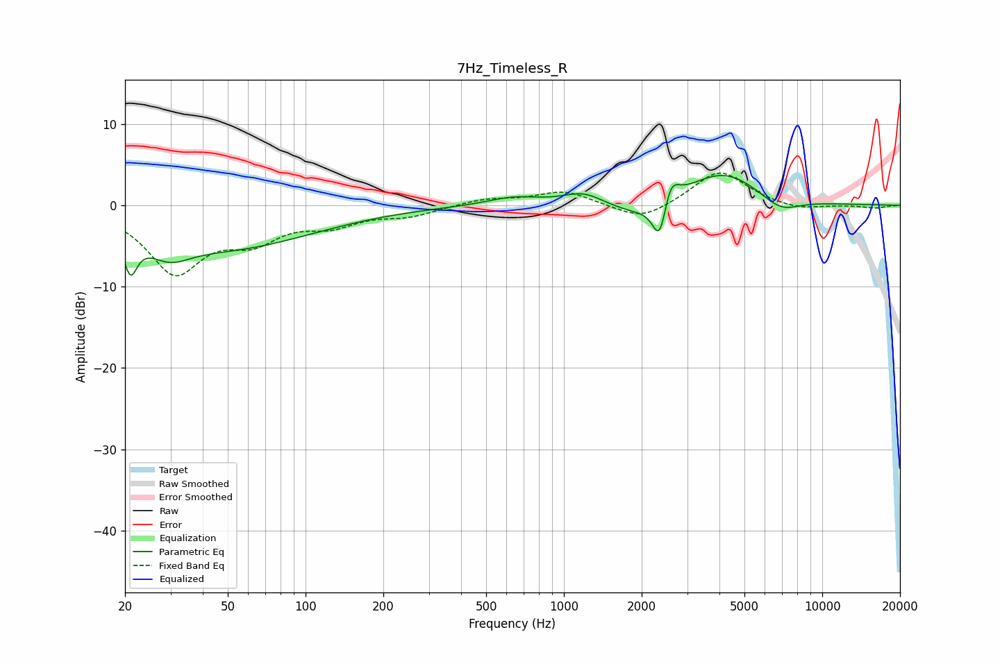

# 7Hz_Timeless_R
See [usage instructions](https://github.com/jaakkopasanen/AutoEq#usage) for more options and info.

### Parametric EQs
Apply preamp of -3.8 dB when using parametric equalizer.

|   # | Type    |   Fc (Hz) |    Q |   Gain (dB) |
|-----|---------|-----------|------|-------------|
|   1 | Peaking |        21 | 5.53 |        -4.5 |
|   2 | Peaking |        30 | 1.76 |        -2.5 |
|   3 | Peaking |        49 | 0.41 |        -5.1 |
|   4 | Peaking |       641 | 1.36 |         1   |
|   5 | Peaking |      1192 | 1.79 |         1.6 |
|   6 | Peaking |      1967 | 1.17 |        -1.9 |
|   7 | Peaking |      2353 | 5.12 |        -5.4 |
|   8 | Peaking |      2576 | 4.53 |         3.5 |
|   9 | Peaking |      4123 | 0.94 |         4.3 |
|  10 | Peaking |      6872 | 1.76 |        -1.9 |

### Fixed Band EQs
When using fixed band (also called graphic) equalizer, apply preamp of **-4.1 dB** (if available) and set gains manually with these parameters.

|   # | Type    |   Fc (Hz) |    Q |   Gain (dB) |
|-----|---------|-----------|------|-------------|
|   1 | Peaking |        31 | 1.41 |        -7.9 |
|   2 | Peaking |        62 | 1.41 |        -3.5 |
|   3 | Peaking |       125 | 1.41 |        -2   |
|   4 | Peaking |       250 | 1.41 |        -1.1 |
|   5 | Peaking |       500 | 1.41 |         0.8 |
|   6 | Peaking |      1000 | 1.41 |         1.8 |
|   7 | Peaking |      2000 | 1.41 |        -2.1 |
|   8 | Peaking |      4000 | 1.41 |         4.4 |
|   9 | Peaking |      8000 | 1.41 |        -0.7 |
|  10 | Peaking |     16000 | 1.41 |        -0.3 |

### Graphs

