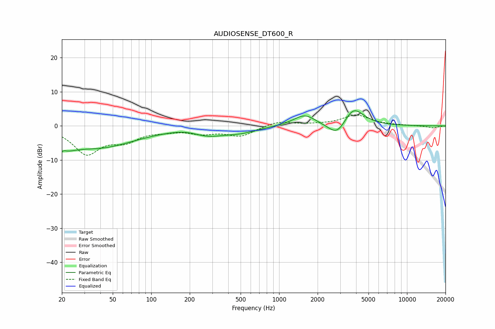

# AUDIOSENSE_DT600_R
See [usage instructions](https://github.com/jaakkopasanen/AutoEq#usage) for more options and info.

### Parametric EQs
Apply preamp of -4.5 dB when using parametric equalizer.

|   # | Type    |   Fc (Hz) |    Q |   Gain (dB) |
|-----|---------|-----------|------|-------------|
|   1 | Peaking |        20 | 4.39 |        -5.2 |
|   2 | Peaking |        20 | 5.65 |         3.4 |
|   3 | Peaking |        23 | 1.72 |        -1.7 |
|   4 | Peaking |        39 | 0.48 |        -6.1 |
|   5 | Peaking |       194 | 1.18 |         1   |
|   6 | Peaking |       271 | 1.02 |        -2.6 |
|   7 | Peaking |       504 | 1.09 |        -1.5 |
|   8 | Peaking |      1583 | 1.62 |         3.3 |
|   9 | Peaking |      2858 | 1.96 |        -4.5 |
|  10 | Peaking |      3793 | 1.74 |         6   |

### Fixed Band EQs
When using fixed band (also called graphic) equalizer, apply preamp of **-3.3 dB** (if available) and set gains manually with these parameters.

|   # | Type    |   Fc (Hz) |    Q |   Gain (dB) |
|-----|---------|-----------|------|-------------|
|   1 | Peaking |        31 | 1.41 |        -7.8 |
|   2 | Peaking |        62 | 1.41 |        -3.7 |
|   3 | Peaking |       125 | 1.41 |        -1   |
|   4 | Peaking |       250 | 1.41 |        -1.8 |
|   5 | Peaking |       500 | 1.41 |        -2.9 |
|   6 | Peaking |      1000 | 1.41 |         1.5 |
|   7 | Peaking |      2000 | 1.41 |         0.3 |
|   8 | Peaking |      4000 | 1.41 |         3.1 |
|   9 | Peaking |      8000 | 1.41 |         0.2 |
|  10 | Peaking |     16000 | 1.41 |        -0.6 |

### Graphs

