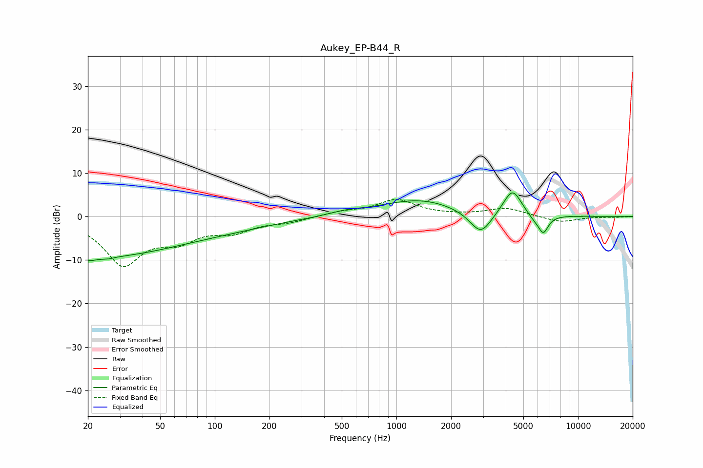

# Aukey_EP-B44_R
See [usage instructions](https://github.com/jaakkopasanen/AutoEq#usage) for more options and info.

### Parametric EQs
Apply preamp of -5.5 dB when using parametric equalizer.

|   # | Type    |   Fc (Hz) |    Q |   Gain (dB) |
|-----|---------|-----------|------|-------------|
|   1 | Peaking |        20 | 2.96 |        -0.8 |
|   2 | Peaking |        24 | 0.2  |        -9.6 |
|   3 | Peaking |        26 | 5.1  |        -0.3 |
|   4 | Peaking |        68 | 0.59 |         1   |
|   5 | Peaking |       525 | 1.55 |         0.7 |
|   6 | Peaking |      1335 | 0.65 |         3.9 |
|   7 | Peaking |      2912 | 2.28 |        -5.6 |
|   8 | Peaking |      4353 | 2.68 |         6.3 |
|   9 | Peaking |      5706 | 3.06 |        -1.4 |
|  10 | Peaking |      6438 | 4.9  |        -3.9 |

### Fixed Band EQs
When using fixed band (also called graphic) equalizer, apply preamp of **-4.0 dB** (if available) and set gains manually with these parameters.

|   # | Type    |   Fc (Hz) |    Q |   Gain (dB) |
|-----|---------|-----------|------|-------------|
|   1 | Peaking |        31 | 1.41 |       -10.6 |
|   2 | Peaking |        62 | 1.41 |        -4.3 |
|   3 | Peaking |       125 | 1.41 |        -2.9 |
|   4 | Peaking |       250 | 1.41 |        -1.1 |
|   5 | Peaking |       500 | 1.41 |         1   |
|   6 | Peaking |      1000 | 1.41 |         3.7 |
|   7 | Peaking |      2000 | 1.41 |         0.1 |
|   8 | Peaking |      4000 | 1.41 |         1.9 |
|   9 | Peaking |      8000 | 1.41 |        -1.4 |
|  10 | Peaking |     16000 | 1.41 |        -0.2 |

### Graphs

