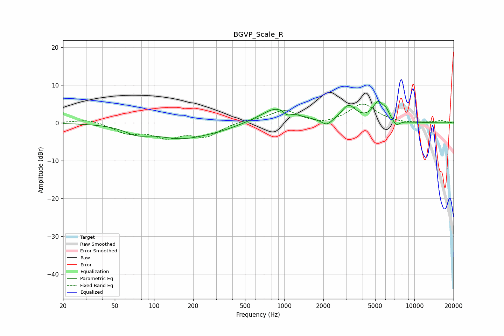

# BGVP_Scale_R
See [usage instructions](https://github.com/jaakkopasanen/AutoEq#usage) for more options and info.

### Parametric EQs
Apply preamp of -5.8 dB when using parametric equalizer.

|   # | Type    |   Fc (Hz) |    Q |   Gain (dB) |
|-----|---------|-----------|------|-------------|
|   1 | Peaking |        73 | 1.61 |        -1.8 |
|   2 | Peaking |       162 | 0.69 |        -3.8 |
|   3 | Peaking |       321 | 0.96 |        -0.9 |
|   4 | Peaking |       890 | 1.14 |         4.3 |
|   5 | Peaking |      1054 | 4.75 |        -1.3 |
|   6 | Peaking |      2128 | 3.48 |        -1.8 |
|   7 | Peaking |      3121 | 2.59 |         4.2 |
|   8 | Peaking |      5291 | 3.19 |         5   |
|   9 | Peaking |      6090 | 5.98 |         1.5 |
|  10 | Peaking |      7267 | 5.1  |        -1.5 |

### Fixed Band EQs
When using fixed band (also called graphic) equalizer, apply preamp of **-5.1 dB** (if available) and set gains manually with these parameters.

|   # | Type    |   Fc (Hz) |    Q |   Gain (dB) |
|-----|---------|-----------|------|-------------|
|   1 | Peaking |        31 | 1.41 |         1.1 |
|   2 | Peaking |        62 | 1.41 |        -2.5 |
|   3 | Peaking |       125 | 1.41 |        -3.3 |
|   4 | Peaking |       250 | 1.41 |        -3.3 |
|   5 | Peaking |       500 | 1.41 |         0.6 |
|   6 | Peaking |      1000 | 1.41 |         3.3 |
|   7 | Peaking |      2000 | 1.41 |        -0.8 |
|   8 | Peaking |      4000 | 1.41 |         5   |
|   9 | Peaking |      8000 | 1.41 |        -0.2 |
|  10 | Peaking |     16000 | 1.41 |         0.6 |

### Graphs

