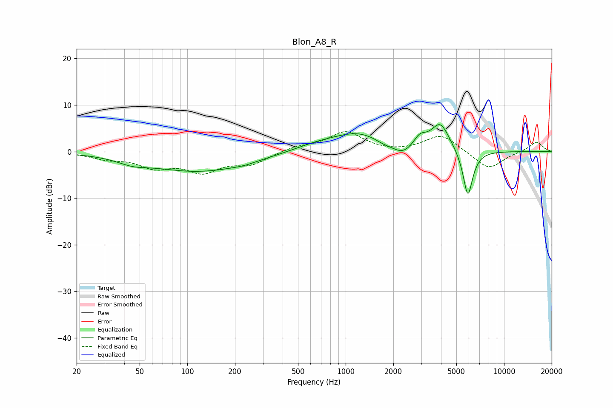

# Blon_A8_R
See [usage instructions](https://github.com/jaakkopasanen/AutoEq#usage) for more options and info.

### Parametric EQs
Apply preamp of -5.9 dB when using parametric equalizer.

|   # | Type    |   Fc (Hz) |    Q |   Gain (dB) |
|-----|---------|-----------|------|-------------|
|   1 | Peaking |        45 | 1.5  |        -1.1 |
|   2 | Peaking |       119 | 0.45 |        -4.2 |
|   3 | Peaking |       227 | 2.08 |        -0.4 |
|   4 | Peaking |       636 | 1    |         1   |
|   5 | Peaking |      1211 | 0.81 |         3.9 |
|   6 | Peaking |      1740 | 2.33 |        -0.8 |
|   7 | Peaking |      2299 | 2.15 |        -2.3 |
|   8 | Peaking |      2939 | 3.48 |         2.3 |
|   9 | Peaking |      3962 | 2.37 |         5.9 |
|  10 | Peaking |      5910 | 4.36 |       -10.3 |

### Fixed Band EQs
When using fixed band (also called graphic) equalizer, apply preamp of **-4.4 dB** (if available) and set gains manually with these parameters.

|   # | Type    |   Fc (Hz) |    Q |   Gain (dB) |
|-----|---------|-----------|------|-------------|
|   1 | Peaking |        31 | 1.41 |        -1.3 |
|   2 | Peaking |        62 | 1.41 |        -3   |
|   3 | Peaking |       125 | 1.41 |        -3.9 |
|   4 | Peaking |       250 | 1.41 |        -2.5 |
|   5 | Peaking |       500 | 1.41 |         1   |
|   6 | Peaking |      1000 | 1.41 |         4.2 |
|   7 | Peaking |      2000 | 1.41 |        -0.3 |
|   8 | Peaking |      4000 | 1.41 |         3.7 |
|   9 | Peaking |      8000 | 1.41 |        -3.9 |
|  10 | Peaking |     16000 | 1.41 |         2.2 |

### Graphs

