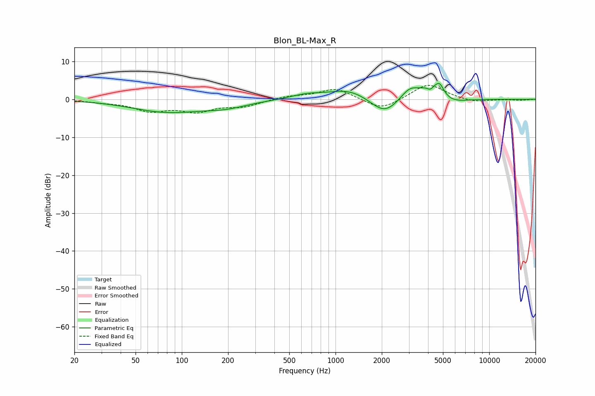

# Blon_BL-Max_R
See [usage instructions](https://github.com/jaakkopasanen/AutoEq#usage) for more options and info.

### Parametric EQs
Apply preamp of -4.3 dB when using parametric equalizer.

|   # | Type    |   Fc (Hz) |    Q |   Gain (dB) |
|-----|---------|-----------|------|-------------|
|   1 | Peaking |        80 | 0.61 |        -3.2 |
|   2 | Peaking |       193 | 0.99 |        -1.5 |
|   3 | Peaking |       648 | 1.38 |         1.1 |
|   4 | Peaking |      1234 | 1.06 |         2.7 |
|   5 | Peaking |      2083 | 1.54 |        -4.6 |
|   6 | Peaking |      3037 | 2.36 |         3.1 |
|   7 | Peaking |      4150 | 6    |        -1.8 |
|   8 | Peaking |      4322 | 2.1  |         4.7 |
|   9 | Peaking |      4774 | 6    |         1.9 |
|  10 | Peaking |      5489 | 1.56 |        -1.8 |

### Fixed Band EQs
When using fixed band (also called graphic) equalizer, apply preamp of **-3.8 dB** (if available) and set gains manually with these parameters.

|   # | Type    |   Fc (Hz) |    Q |   Gain (dB) |
|-----|---------|-----------|------|-------------|
|   1 | Peaking |        31 | 1.41 |        -0.6 |
|   2 | Peaking |        62 | 1.41 |        -2.8 |
|   3 | Peaking |       125 | 1.41 |        -2.8 |
|   4 | Peaking |       250 | 1.41 |        -1.7 |
|   5 | Peaking |       500 | 1.41 |         0.8 |
|   6 | Peaking |      1000 | 1.41 |         2.9 |
|   7 | Peaking |      2000 | 1.41 |        -3   |
|   8 | Peaking |      4000 | 1.41 |         4.2 |
|   9 | Peaking |      8000 | 1.41 |        -0.9 |
|  10 | Peaking |     16000 | 1.41 |        -0.2 |

### Graphs

