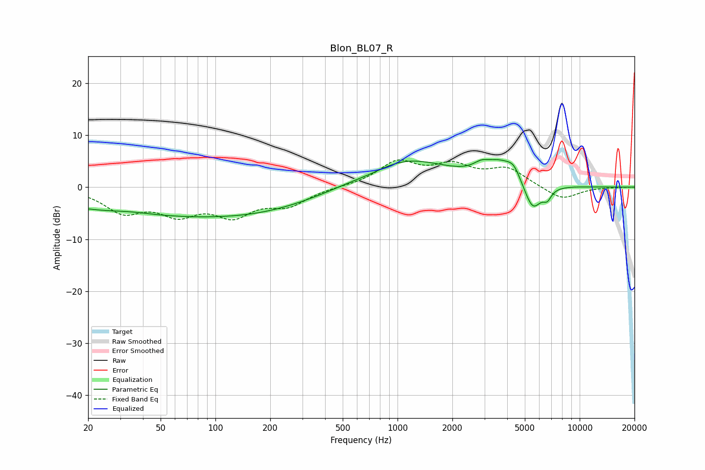

# Blon_BL07_R
See [usage instructions](https://github.com/jaakkopasanen/AutoEq#usage) for more options and info.

### Parametric EQs
Apply preamp of -5.4 dB when using parametric equalizer.

|   # | Type    |   Fc (Hz) |    Q |   Gain (dB) |
|-----|---------|-----------|------|-------------|
|   1 | Peaking |        34 | 1.25 |         0.5 |
|   2 | Peaking |        52 | 0.21 |        -5.3 |
|   3 | Peaking |       236 | 0.43 |        -1.7 |
|   4 | Peaking |       720 | 1.53 |        -0.5 |
|   5 | Peaking |      1089 | 0.58 |         5.6 |
|   6 | Peaking |      2881 | 3.29 |         1.2 |
|   7 | Peaking |      3679 | 1.59 |         3.8 |
|   8 | Peaking |      4347 | 3.9  |         2   |
|   9 | Peaking |      5514 | 2.87 |        -5.5 |
|  10 | Peaking |      6639 | 5.99 |        -1.8 |

### Fixed Band EQs
When using fixed band (also called graphic) equalizer, apply preamp of **-5.3 dB** (if available) and set gains manually with these parameters.

|   # | Type    |   Fc (Hz) |    Q |   Gain (dB) |
|-----|---------|-----------|------|-------------|
|   1 | Peaking |        31 | 1.41 |        -4.4 |
|   2 | Peaking |        62 | 1.41 |        -4.4 |
|   3 | Peaking |       125 | 1.41 |        -4.8 |
|   4 | Peaking |       250 | 1.41 |        -3.1 |
|   5 | Peaking |       500 | 1.41 |         0   |
|   6 | Peaking |      1000 | 1.41 |         4.6 |
|   7 | Peaking |      2000 | 1.41 |         3.6 |
|   8 | Peaking |      4000 | 1.41 |         3.4 |
|   9 | Peaking |      8000 | 1.41 |        -2.5 |
|  10 | Peaking |     16000 | 1.41 |        -0   |

### Graphs

