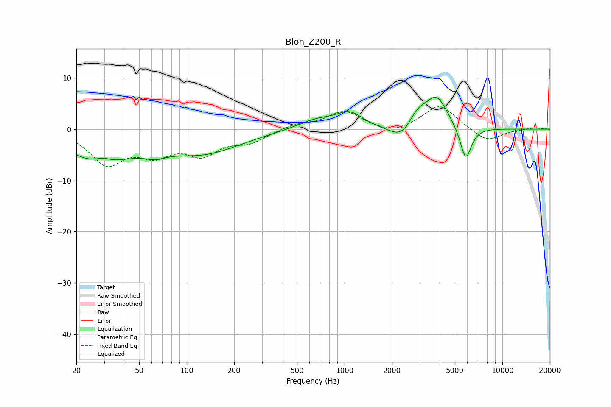

# Blon_Z200_R
See [usage instructions](https://github.com/jaakkopasanen/AutoEq#usage) for more options and info.

### Parametric EQs
Apply preamp of -6.3 dB when using parametric equalizer.

|   # | Type    |   Fc (Hz) |    Q |   Gain (dB) |
|-----|---------|-----------|------|-------------|
|   1 | Peaking |        28 | 0.7  |        -6   |
|   2 | Peaking |        29 | 2.86 |         1.1 |
|   3 | Peaking |        63 | 2.17 |        -1.3 |
|   4 | Peaking |       127 | 0.58 |        -4.4 |
|   5 | Peaking |       671 | 1.11 |         1.9 |
|   6 | Peaking |      1080 | 1.75 |         2.8 |
|   7 | Peaking |      2317 | 1.77 |        -3   |
|   8 | Peaking |      2889 | 2.53 |         2.9 |
|   9 | Peaking |      3824 | 1.94 |         6.3 |
|  10 | Peaking |      5859 | 3.79 |        -6.8 |

### Fixed Band EQs
When using fixed band (also called graphic) equalizer, apply preamp of **-4.5 dB** (if available) and set gains manually with these parameters.

|   # | Type    |   Fc (Hz) |    Q |   Gain (dB) |
|-----|---------|-----------|------|-------------|
|   1 | Peaking |        31 | 1.41 |        -6.4 |
|   2 | Peaking |        62 | 1.41 |        -4   |
|   3 | Peaking |       125 | 1.41 |        -4.3 |
|   4 | Peaking |       250 | 1.41 |        -2.2 |
|   5 | Peaking |       500 | 1.41 |         0.9 |
|   6 | Peaking |      1000 | 1.41 |         3.5 |
|   7 | Peaking |      2000 | 1.41 |        -1.2 |
|   8 | Peaking |      4000 | 1.41 |         4.8 |
|   9 | Peaking |      8000 | 1.41 |        -2.6 |
|  10 | Peaking |     16000 | 1.41 |         0.3 |

### Graphs

