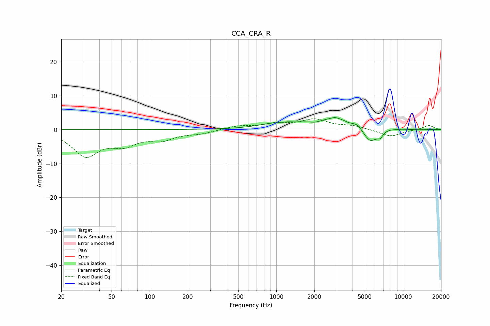

# CCA_CRA_R
See [usage instructions](https://github.com/jaakkopasanen/AutoEq#usage) for more options and info.

### Parametric EQs
Apply preamp of -3.7 dB when using parametric equalizer.

|   # | Type    |   Fc (Hz) |    Q |   Gain (dB) |
|-----|---------|-----------|------|-------------|
|   1 | Peaking |       963 | 1.12 |         1.1 |
|   2 | Peaking |      1257 | 4.94 |         0.2 |
|   3 | Peaking |      2040 | 3.03 |        -0.7 |
|   4 | Peaking |      2916 | 5.11 |         0.5 |
|   5 | Peaking |      3074 | 0.58 |         3.6 |
|   6 | Peaking |      3700 | 5.79 |        -0.4 |
|   7 | Peaking |      4402 | 6    |         0.6 |
|   8 | Peaking |      5511 | 2.29 |        -5.2 |
|   9 | Peaking |      6616 | 6    |        -1.6 |
|  10 | Peaking |     10000 | 1.99 |        -0.3 |

### Fixed Band EQs
When using fixed band (also called graphic) equalizer, apply preamp of **-3.3 dB** (if available) and set gains manually with these parameters.

|   # | Type    |   Fc (Hz) |    Q |   Gain (dB) |
|-----|---------|-----------|------|-------------|
|   1 | Peaking |        31 | 1.41 |        -7.5 |
|   2 | Peaking |        62 | 1.41 |        -3.7 |
|   3 | Peaking |       125 | 1.41 |        -2.5 |
|   4 | Peaking |       250 | 1.41 |        -1   |
|   5 | Peaking |       500 | 1.41 |         1   |
|   6 | Peaking |      1000 | 1.41 |         1.5 |
|   7 | Peaking |      2000 | 1.41 |         2.8 |
|   8 | Peaking |      4000 | 1.41 |         1   |
|   9 | Peaking |      8000 | 1.41 |        -2.1 |
|  10 | Peaking |     16000 | 1.41 |         1.3 |

### Graphs

