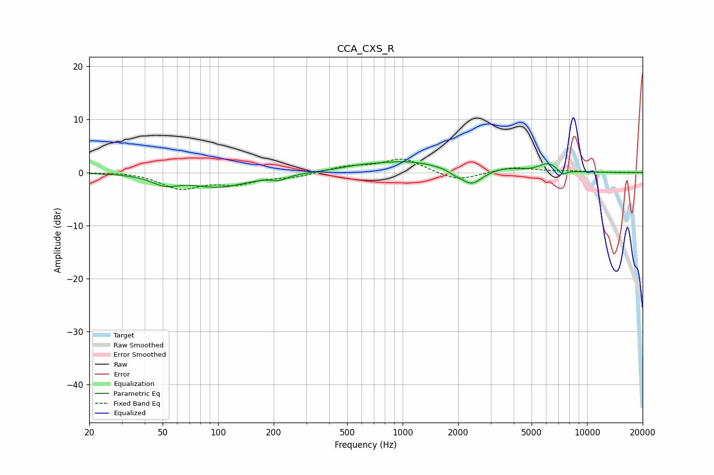

# CCA_CXS_R
See [usage instructions](https://github.com/jaakkopasanen/AutoEq#usage) for more options and info.

### Parametric EQs
Apply preamp of -2.1 dB when using parametric equalizer.

|   # | Type    |   Fc (Hz) |    Q |   Gain (dB) |
|-----|---------|-----------|------|-------------|
|   1 | Peaking |        52 | 2.03 |        -1.7 |
|   2 | Peaking |       101 | 0.89 |        -2.6 |
|   3 | Peaking |       214 | 3.31 |        -0.9 |
|   4 | Peaking |       584 | 1.2  |         0.6 |
|   5 | Peaking |      1074 | 0.76 |         2   |
|   6 | Peaking |      1914 | 4.89 |        -0.4 |
|   7 | Peaking |      2355 | 2.44 |        -2.9 |
|   8 | Peaking |      3553 | 1.77 |         0.7 |
|   9 | Peaking |      6153 | 2.7  |         1.6 |
|  10 | Peaking |      7369 | 5.76 |        -1   |

### Fixed Band EQs
When using fixed band (also called graphic) equalizer, apply preamp of **-2.6 dB** (if available) and set gains manually with these parameters.

|   # | Type    |   Fc (Hz) |    Q |   Gain (dB) |
|-----|---------|-----------|------|-------------|
|   1 | Peaking |        31 | 1.41 |         0.2 |
|   2 | Peaking |        62 | 1.41 |        -2.9 |
|   3 | Peaking |       125 | 1.41 |        -1.8 |
|   4 | Peaking |       250 | 1.41 |        -0.8 |
|   5 | Peaking |       500 | 1.41 |         1.1 |
|   6 | Peaking |      1000 | 1.41 |         2.6 |
|   7 | Peaking |      2000 | 1.41 |        -1.7 |
|   8 | Peaking |      4000 | 1.41 |         1   |
|   9 | Peaking |      8000 | 1.41 |         0.2 |
|  10 | Peaking |     16000 | 1.41 |        -0   |

### Graphs

