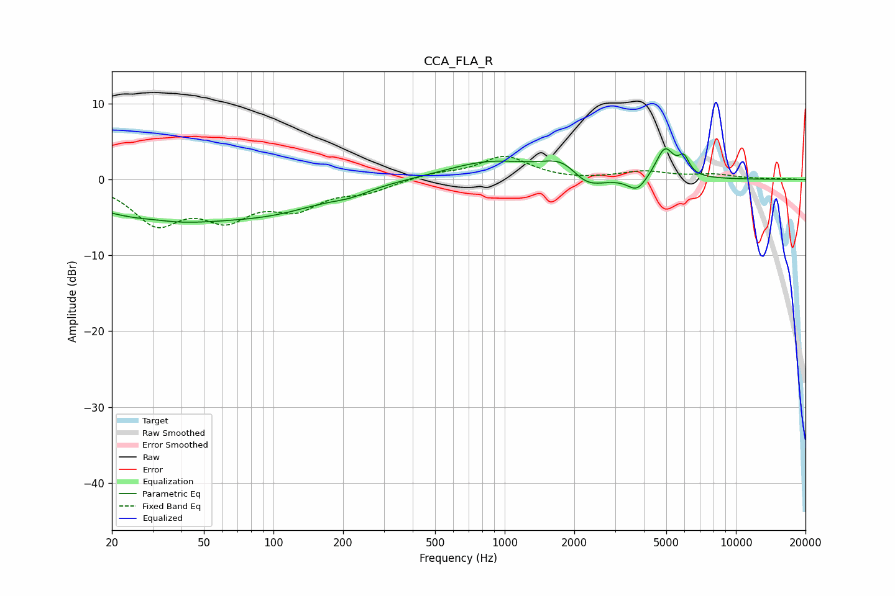

# CCA_FLA_R
See [usage instructions](https://github.com/jaakkopasanen/AutoEq#usage) for more options and info.

### Parametric EQs
Apply preamp of -4.1 dB when using parametric equalizer.

|   # | Type    |   Fc (Hz) |    Q |   Gain (dB) |
|-----|---------|-----------|------|-------------|
|   1 | Peaking |        31 | 1.99 |         0.3 |
|   2 | Peaking |        32 | 0.43 |        -5   |
|   3 | Peaking |       105 | 0.6  |        -2.7 |
|   4 | Peaking |       216 | 1.75 |        -0.7 |
|   5 | Peaking |       862 | 0.74 |         2.3 |
|   6 | Peaking |      1831 | 1.57 |         3   |
|   7 | Peaking |      2211 | 1.72 |        -2.9 |
|   8 | Peaking |      3738 | 3.45 |        -1.9 |
|   9 | Peaking |      4930 | 3.58 |         4   |
|  10 | Peaking |      5959 | 6    |         2.2 |

### Fixed Band EQs
When using fixed band (also called graphic) equalizer, apply preamp of **-3.1 dB** (if available) and set gains manually with these parameters.

|   # | Type    |   Fc (Hz) |    Q |   Gain (dB) |
|-----|---------|-----------|------|-------------|
|   1 | Peaking |        31 | 1.41 |        -5.4 |
|   2 | Peaking |        62 | 1.41 |        -4.4 |
|   3 | Peaking |       125 | 1.41 |        -3.3 |
|   4 | Peaking |       250 | 1.41 |        -1.4 |
|   5 | Peaking |       500 | 1.41 |         0.7 |
|   6 | Peaking |      1000 | 1.41 |         3   |
|   7 | Peaking |      2000 | 1.41 |        -0.2 |
|   8 | Peaking |      4000 | 1.41 |         1   |
|   9 | Peaking |      8000 | 1.41 |         0.6 |
|  10 | Peaking |     16000 | 1.41 |         0   |

### Graphs

