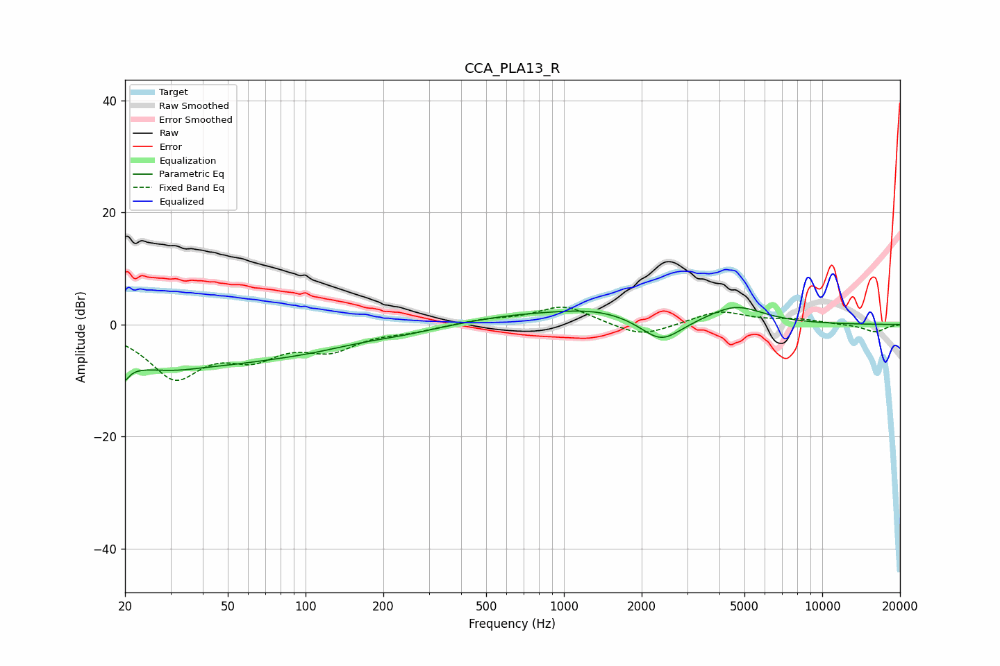

# CCA_PLA13_R
See [usage instructions](https://github.com/jaakkopasanen/AutoEq#usage) for more options and info.

### Parametric EQs
Apply preamp of -3.1 dB when using parametric equalizer.

|   # | Type    |   Fc (Hz) |    Q |   Gain (dB) |
|-----|---------|-----------|------|-------------|
|   1 | Peaking |        20 | 5.45 |        -6.7 |
|   2 | Peaking |        20 | 5.81 |         3.3 |
|   3 | Peaking |        31 | 0.49 |        -7.9 |
|   4 | Peaking |        40 | 1.25 |         0.8 |
|   5 | Peaking |       103 | 0.59 |        -2.7 |
|   6 | Peaking |       244 | 1.19 |        -0.6 |
|   7 | Peaking |       605 | 0.77 |         1   |
|   8 | Peaking |      1342 | 0.73 |         2.5 |
|   9 | Peaking |      2376 | 1.75 |        -4.5 |
|  10 | Peaking |      4620 | 1.3  |         3.2 |

### Fixed Band EQs
When using fixed band (also called graphic) equalizer, apply preamp of **-3.2 dB** (if available) and set gains manually with these parameters.

|   # | Type    |   Fc (Hz) |    Q |   Gain (dB) |
|-----|---------|-----------|------|-------------|
|   1 | Peaking |        31 | 1.41 |        -8.9 |
|   2 | Peaking |        62 | 1.41 |        -4.6 |
|   3 | Peaking |       125 | 1.41 |        -3.9 |
|   4 | Peaking |       250 | 1.41 |        -0.9 |
|   5 | Peaking |       500 | 1.41 |         0.8 |
|   6 | Peaking |      1000 | 1.41 |         3.4 |
|   7 | Peaking |      2000 | 1.41 |        -2.4 |
|   8 | Peaking |      4000 | 1.41 |         2.4 |
|   9 | Peaking |      8000 | 1.41 |         0.8 |
|  10 | Peaking |     16000 | 1.41 |        -1.4 |

### Graphs

