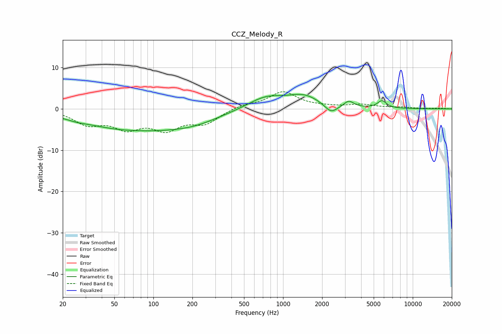

# CCZ_Melody_R
See [usage instructions](https://github.com/jaakkopasanen/AutoEq#usage) for more options and info.

### Parametric EQs
Apply preamp of -3.6 dB when using parametric equalizer.

|   # | Type    |   Fc (Hz) |    Q |   Gain (dB) |
|-----|---------|-----------|------|-------------|
|   1 | Peaking |        21 | 4.05 |        -0   |
|   2 | Peaking |        26 | 2.12 |        -0.4 |
|   3 | Peaking |        70 | 0.36 |        -5   |
|   4 | Peaking |        74 | 1.34 |         0.2 |
|   5 | Peaking |       209 | 0.7  |        -1.8 |
|   6 | Peaking |       737 | 1.01 |         2.8 |
|   7 | Peaking |      1455 | 1.13 |         2.9 |
|   8 | Peaking |      2343 | 2.86 |        -2.2 |
|   9 | Peaking |      3211 | 3.86 |         1.6 |
|  10 | Peaking |      5792 | 4.02 |         1.8 |

### Fixed Band EQs
When using fixed band (also called graphic) equalizer, apply preamp of **-4.2 dB** (if available) and set gains manually with these parameters.

|   # | Type    |   Fc (Hz) |    Q |   Gain (dB) |
|-----|---------|-----------|------|-------------|
|   1 | Peaking |        31 | 1.41 |        -3.4 |
|   2 | Peaking |        62 | 1.41 |        -4.1 |
|   3 | Peaking |       125 | 1.41 |        -4.4 |
|   4 | Peaking |       250 | 1.41 |        -3.2 |
|   5 | Peaking |       500 | 1.41 |         1   |
|   6 | Peaking |      1000 | 1.41 |         4   |
|   7 | Peaking |      2000 | 1.41 |         0.4 |
|   8 | Peaking |      4000 | 1.41 |         0.9 |
|   9 | Peaking |      8000 | 1.41 |         0.3 |
|  10 | Peaking |     16000 | 1.41 |         0.1 |

### Graphs

