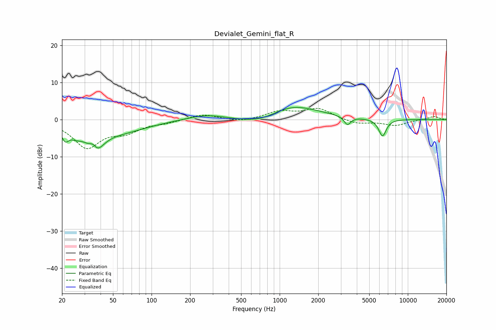

# Devialet_Gemini_flat_R
See [usage instructions](https://github.com/jaakkopasanen/AutoEq#usage) for more options and info.

### Parametric EQs
Apply preamp of -3.4 dB when using parametric equalizer.

|   # | Type    |   Fc (Hz) |    Q |   Gain (dB) |
|-----|---------|-----------|------|-------------|
|   1 | Peaking |        21 | 5.16 |        -3.2 |
|   2 | Peaking |        26 | 2.58 |        -2   |
|   3 | Peaking |        35 | 4.81 |         3   |
|   4 | Peaking |        36 | 2.41 |        -7   |
|   5 | Peaking |        55 | 0.64 |        -3.1 |
|   6 | Peaking |       268 | 0.96 |         1.4 |
|   7 | Peaking |       765 | 0.77 |        -3.5 |
|   8 | Peaking |      1153 | 0.67 |         5.3 |
|   9 | Peaking |      3379 | 5.49 |        -2.3 |
|  10 | Peaking |      6344 | 4.6  |        -4.6 |

### Fixed Band EQs
When using fixed band (also called graphic) equalizer, apply preamp of **-3.1 dB** (if available) and set gains manually with these parameters.

|   # | Type    |   Fc (Hz) |    Q |   Gain (dB) |
|-----|---------|-----------|------|-------------|
|   1 | Peaking |        31 | 1.41 |        -7.3 |
|   2 | Peaking |        62 | 1.41 |        -2.8 |
|   3 | Peaking |       125 | 1.41 |        -0.7 |
|   4 | Peaking |       250 | 1.41 |         1.5 |
|   5 | Peaking |       500 | 1.41 |        -0.7 |
|   6 | Peaking |      1000 | 1.41 |         2   |
|   7 | Peaking |      2000 | 1.41 |         2.9 |
|   8 | Peaking |      4000 | 1.41 |        -1.2 |
|   9 | Peaking |      8000 | 1.41 |        -1.5 |
|  10 | Peaking |     16000 | 1.41 |         0.9 |

### Graphs

