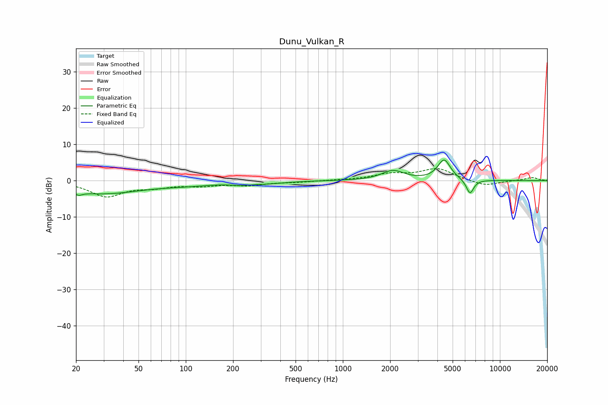

# Dunu_Vulkan_R
See [usage instructions](https://github.com/jaakkopasanen/AutoEq#usage) for more options and info.

### Parametric EQs
Apply preamp of -5.8 dB when using parametric equalizer.

|   # | Type    |   Fc (Hz) |    Q |   Gain (dB) |
|-----|---------|-----------|------|-------------|
|   1 | Peaking |        21 | 6    |         2.8 |
|   2 | Peaking |        21 | 5.94 |        -3.7 |
|   3 | Peaking |        29 | 0.56 |        -3.5 |
|   4 | Peaking |       103 | 0.77 |        -0.8 |
|   5 | Peaking |       225 | 2.37 |        -1.4 |
|   6 | Peaking |       227 | 2.21 |         0.9 |
|   7 | Peaking |       318 | 1.11 |        -0.7 |
|   8 | Peaking |      2083 | 2.01 |         2.7 |
|   9 | Peaking |      4414 | 3.42 |         5.6 |
|  10 | Peaking |      6449 | 5.68 |        -4   |

### Fixed Band EQs
When using fixed band (also called graphic) equalizer, apply preamp of **-3.4 dB** (if available) and set gains manually with these parameters.

|   # | Type    |   Fc (Hz) |    Q |   Gain (dB) |
|-----|---------|-----------|------|-------------|
|   1 | Peaking |        31 | 1.41 |        -4.2 |
|   2 | Peaking |        62 | 1.41 |        -1.4 |
|   3 | Peaking |       125 | 1.41 |        -1.2 |
|   4 | Peaking |       250 | 1.41 |        -1.1 |
|   5 | Peaking |       500 | 1.41 |        -0.4 |
|   6 | Peaking |      1000 | 1.41 |         0.1 |
|   7 | Peaking |      2000 | 1.41 |         1.6 |
|   8 | Peaking |      4000 | 1.41 |         3.2 |
|   9 | Peaking |      8000 | 1.41 |        -1.6 |
|  10 | Peaking |     16000 | 1.41 |         0.9 |

### Graphs

