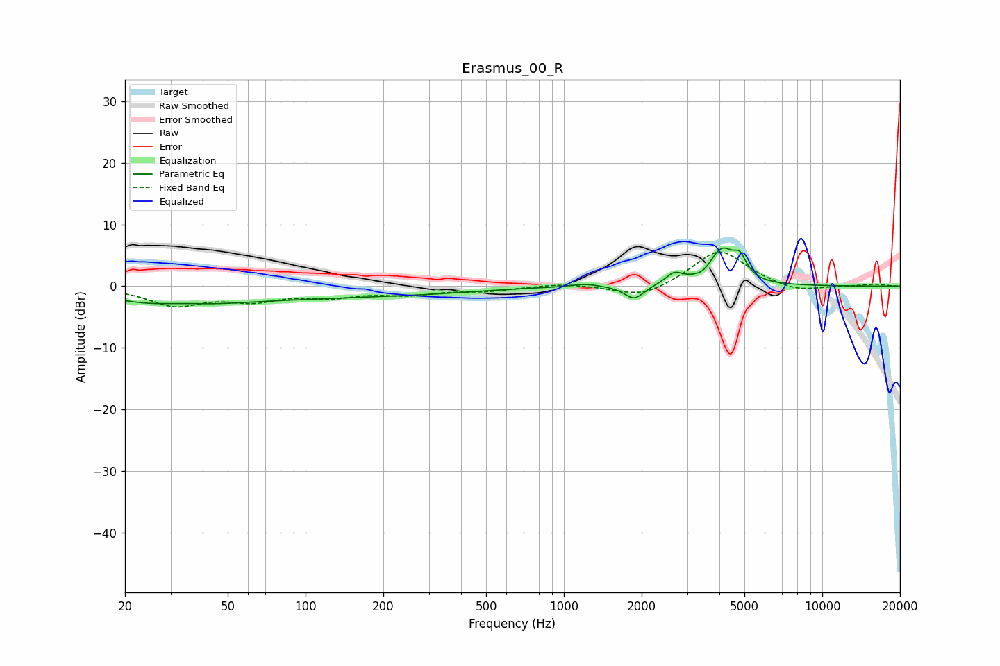

# Erasmus_00_R
See [usage instructions](https://github.com/jaakkopasanen/AutoEq#usage) for more options and info.

### Parametric EQs
Apply preamp of -6.3 dB when using parametric equalizer.

|   # | Type    |   Fc (Hz) |    Q |   Gain (dB) |
|-----|---------|-----------|------|-------------|
|   1 | Peaking |        30 | 0.72 |        -2.7 |
|   2 | Peaking |        33 | 1.3  |         1.1 |
|   3 | Peaking |        86 | 0.29 |        -1.7 |
|   4 | Peaking |       326 | 0.66 |        -0.4 |
|   5 | Peaking |      1205 | 2.71 |         0.5 |
|   6 | Peaking |      1873 | 3.77 |        -2.3 |
|   7 | Peaking |      2678 | 4.2  |         1.7 |
|   8 | Peaking |      3481 | 5.15 |        -0.5 |
|   9 | Peaking |      4090 | 2.83 |         5.7 |
|  10 | Peaking |      4807 | 5.72 |         2.8 |

### Fixed Band EQs
When using fixed band (also called graphic) equalizer, apply preamp of **-5.6 dB** (if available) and set gains manually with these parameters.

|   # | Type    |   Fc (Hz) |    Q |   Gain (dB) |
|-----|---------|-----------|------|-------------|
|   1 | Peaking |        31 | 1.41 |        -2.9 |
|   2 | Peaking |        62 | 1.41 |        -2   |
|   3 | Peaking |       125 | 1.41 |        -1.4 |
|   4 | Peaking |       250 | 1.41 |        -1.1 |
|   5 | Peaking |       500 | 1.41 |        -0.7 |
|   6 | Peaking |      1000 | 1.41 |         0.5 |
|   7 | Peaking |      2000 | 1.41 |        -2   |
|   8 | Peaking |      4000 | 1.41 |         6   |
|   9 | Peaking |      8000 | 1.41 |        -1.1 |
|  10 | Peaking |     16000 | 1.41 |         0.3 |

### Graphs

