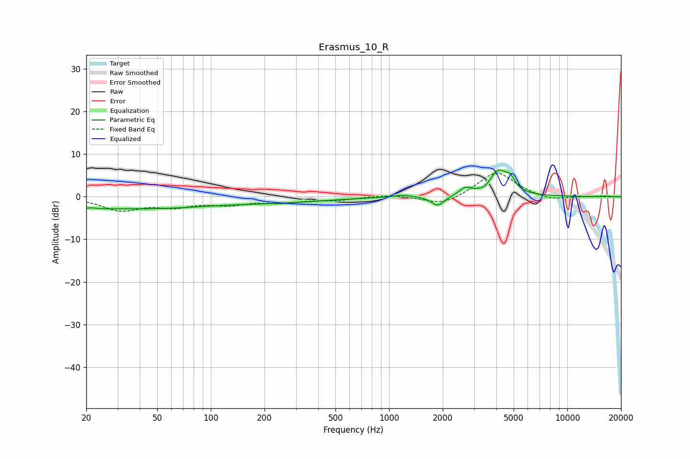

# Erasmus_10_R
See [usage instructions](https://github.com/jaakkopasanen/AutoEq#usage) for more options and info.

### Parametric EQs
Apply preamp of -6.3 dB when using parametric equalizer.

|   # | Type    |   Fc (Hz) |    Q |   Gain (dB) |
|-----|---------|-----------|------|-------------|
|   1 | Peaking |        20 | 2.15 |        -2.6 |
|   2 | Peaking |        21 | 3.15 |         1.8 |
|   3 | Peaking |        43 | 0.38 |        -2.6 |
|   4 | Peaking |       250 | 0.53 |        -1.1 |
|   5 | Peaking |      1193 | 2.73 |         0.5 |
|   6 | Peaking |      1875 | 3.96 |        -2.3 |
|   7 | Peaking |      2673 | 4.37 |         1.6 |
|   8 | Peaking |      3472 | 5.36 |        -0.8 |
|   9 | Peaking |      4107 | 2.59 |         5.9 |
|  10 | Peaking |      4790 | 5.89 |         2.1 |

### Fixed Band EQs
When using fixed band (also called graphic) equalizer, apply preamp of **-5.6 dB** (if available) and set gains manually with these parameters.

|   # | Type    |   Fc (Hz) |    Q |   Gain (dB) |
|-----|---------|-----------|------|-------------|
|   1 | Peaking |        31 | 1.41 |        -3   |
|   2 | Peaking |        62 | 1.41 |        -1.9 |
|   3 | Peaking |       125 | 1.41 |        -1.5 |
|   4 | Peaking |       250 | 1.41 |        -1.1 |
|   5 | Peaking |       500 | 1.41 |        -0.7 |
|   6 | Peaking |      1000 | 1.41 |         0.5 |
|   7 | Peaking |      2000 | 1.41 |        -2.2 |
|   8 | Peaking |      4000 | 1.41 |         6   |
|   9 | Peaking |      8000 | 1.41 |        -1   |
|  10 | Peaking |     16000 | 1.41 |         0.2 |

### Graphs

