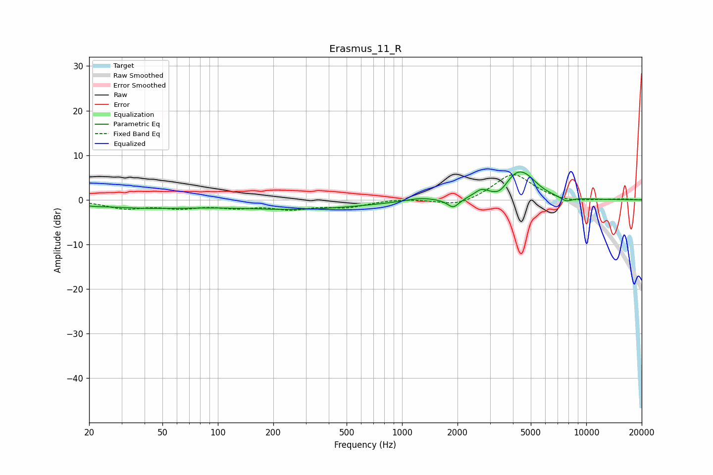

# Erasmus_11_R
See [usage instructions](https://github.com/jaakkopasanen/AutoEq#usage) for more options and info.

### Parametric EQs
Apply preamp of -6.3 dB when using parametric equalizer.

|   # | Type    |   Fc (Hz) |    Q |   Gain (dB) |
|-----|---------|-----------|------|-------------|
|   1 | Peaking |        21 | 2.79 |        -0.2 |
|   2 | Peaking |        39 | 0.49 |        -1.6 |
|   3 | Peaking |       276 | 0.4  |        -2   |
|   4 | Peaking |      1248 | 1.87 |         0.7 |
|   5 | Peaking |      1898 | 4.36 |        -2.1 |
|   6 | Peaking |      2690 | 3.92 |         1.5 |
|   7 | Peaking |      3411 | 3.17 |        -1.8 |
|   8 | Peaking |      4197 | 1.8  |         5.8 |
|   9 | Peaking |      4862 | 2.49 |         1.4 |
|  10 | Peaking |      7782 | 4.03 |        -1   |

### Fixed Band EQs
When using fixed band (also called graphic) equalizer, apply preamp of **-5.7 dB** (if available) and set gains manually with these parameters.

|   # | Type    |   Fc (Hz) |    Q |   Gain (dB) |
|-----|---------|-----------|------|-------------|
|   1 | Peaking |        31 | 1.41 |        -1.8 |
|   2 | Peaking |        62 | 1.41 |        -1.5 |
|   3 | Peaking |       125 | 1.41 |        -1.4 |
|   4 | Peaking |       250 | 1.41 |        -1.8 |
|   5 | Peaking |       500 | 1.41 |        -1.5 |
|   6 | Peaking |      1000 | 1.41 |         0.3 |
|   7 | Peaking |      2000 | 1.41 |        -1.6 |
|   8 | Peaking |      4000 | 1.41 |         6   |
|   9 | Peaking |      8000 | 1.41 |        -0.7 |
|  10 | Peaking |     16000 | 1.41 |         0.2 |

### Graphs

