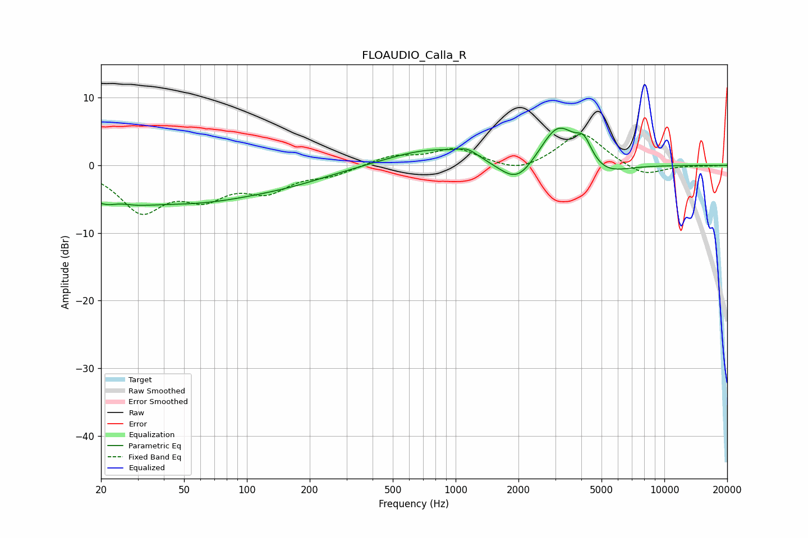

# FLOAUDIO_Calla_R
See [usage instructions](https://github.com/jaakkopasanen/AutoEq#usage) for more options and info.

### Parametric EQs
Apply preamp of -5.6 dB when using parametric equalizer.

|   # | Type    |   Fc (Hz) |    Q |   Gain (dB) |
|-----|---------|-----------|------|-------------|
|   1 | Peaking |        23 | 1.26 |        -5.2 |
|   2 | Peaking |        24 | 2.06 |         2.4 |
|   3 | Peaking |        55 | 0.41 |        -4.8 |
|   4 | Peaking |       167 | 0.66 |        -1.1 |
|   5 | Peaking |       769 | 0.69 |         2.5 |
|   6 | Peaking |      1141 | 2.88 |         1   |
|   7 | Peaking |      1978 | 1.58 |        -4.1 |
|   8 | Peaking |      3097 | 1.54 |         6.6 |
|   9 | Peaking |      4124 | 3.74 |         2.9 |
|  10 | Peaking |      5068 | 1.31 |        -2.2 |

### Fixed Band EQs
When using fixed band (also called graphic) equalizer, apply preamp of **-4.7 dB** (if available) and set gains manually with these parameters.

|   # | Type    |   Fc (Hz) |    Q |   Gain (dB) |
|-----|---------|-----------|------|-------------|
|   1 | Peaking |        31 | 1.41 |        -6.4 |
|   2 | Peaking |        62 | 1.41 |        -3.9 |
|   3 | Peaking |       125 | 1.41 |        -3.3 |
|   4 | Peaking |       250 | 1.41 |        -1.3 |
|   5 | Peaking |       500 | 1.41 |         1.4 |
|   6 | Peaking |      1000 | 1.41 |         2.4 |
|   7 | Peaking |      2000 | 1.41 |        -1.3 |
|   8 | Peaking |      4000 | 1.41 |         5   |
|   9 | Peaking |      8000 | 1.41 |        -1.7 |
|  10 | Peaking |     16000 | 1.41 |        -0.1 |

### Graphs

