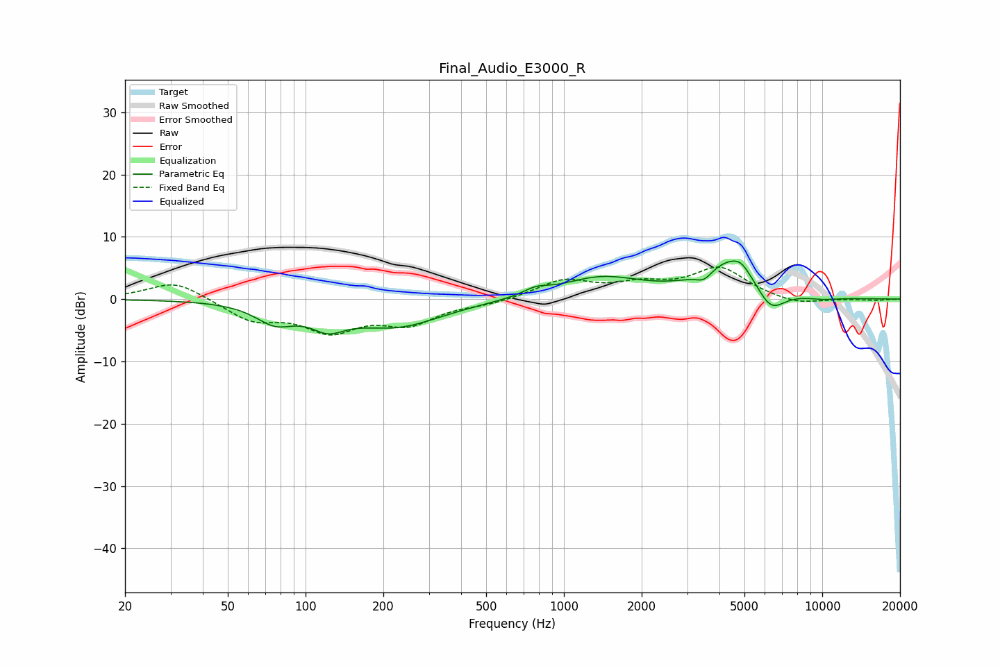

# Final_Audio_E3000_R
See [usage instructions](https://github.com/jaakkopasanen/AutoEq#usage) for more options and info.

### Parametric EQs
Apply preamp of -6.2 dB when using parametric equalizer.

|   # | Type    |   Fc (Hz) |    Q |   Gain (dB) |
|-----|---------|-----------|------|-------------|
|   1 | Peaking |        76 | 1.88 |        -3   |
|   2 | Peaking |       122 | 2.16 |        -2.8 |
|   3 | Peaking |       224 | 0.78 |        -4.3 |
|   4 | Peaking |       779 | 2.87 |         1   |
|   5 | Peaking |      1392 | 0.9  |         3.4 |
|   6 | Peaking |      3485 | 4.52 |        -1.4 |
|   7 | Peaking |      4484 | 1.28 |         6.2 |
|   8 | Peaking |      4852 | 4.44 |         1   |
|   9 | Peaking |      6301 | 2.43 |        -4.2 |
|  10 | Peaking |     10000 | 1.97 |        -0.4 |

### Fixed Band EQs
When using fixed band (also called graphic) equalizer, apply preamp of **-5.2 dB** (if available) and set gains manually with these parameters.

|   # | Type    |   Fc (Hz) |    Q |   Gain (dB) |
|-----|---------|-----------|------|-------------|
|   1 | Peaking |        31 | 1.41 |         3   |
|   2 | Peaking |        62 | 1.41 |        -3.2 |
|   3 | Peaking |       125 | 1.41 |        -4.6 |
|   4 | Peaking |       250 | 1.41 |        -3.6 |
|   5 | Peaking |       500 | 1.41 |        -0.7 |
|   6 | Peaking |      1000 | 1.41 |         2.9 |
|   7 | Peaking |      2000 | 1.41 |         1.9 |
|   8 | Peaking |      4000 | 1.41 |         4.9 |
|   9 | Peaking |      8000 | 1.41 |        -1   |
|  10 | Peaking |     16000 | 1.41 |        -0.2 |

### Graphs

