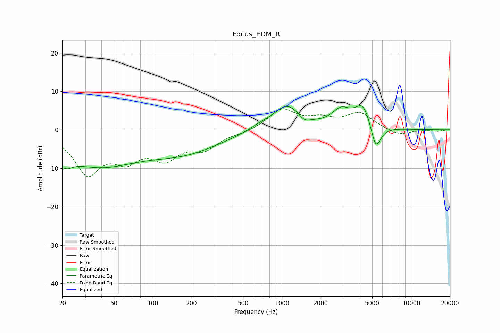

# Focus_EDM_R
See [usage instructions](https://github.com/jaakkopasanen/AutoEq#usage) for more options and info.

### Parametric EQs
Apply preamp of -6.4 dB when using parametric equalizer.

|   # | Type    |   Fc (Hz) |    Q |   Gain (dB) |
|-----|---------|-----------|------|-------------|
|   1 | Peaking |        20 | 3.29 |        -6.6 |
|   2 | Peaking |        21 | 5.82 |         3.1 |
|   3 | Peaking |        38 | 0.44 |        -8.7 |
|   4 | Peaking |       182 | 0.5  |        -4.9 |
|   5 | Peaking |       670 | 1.75 |         0.9 |
|   6 | Peaking |      1094 | 1.29 |         6.4 |
|   7 | Peaking |      1491 | 3.45 |        -1.5 |
|   8 | Peaking |      2867 | 1.96 |         4.2 |
|   9 | Peaking |      4262 | 2.18 |         6.5 |
|  10 | Peaking |      5320 | 3.41 |        -7.3 |

### Fixed Band EQs
When using fixed band (also called graphic) equalizer, apply preamp of **-5.5 dB** (if available) and set gains manually with these parameters.

|   # | Type    |   Fc (Hz) |    Q |   Gain (dB) |
|-----|---------|-----------|------|-------------|
|   1 | Peaking |        31 | 1.41 |       -10.7 |
|   2 | Peaking |        62 | 1.41 |        -6.1 |
|   3 | Peaking |       125 | 1.41 |        -6.3 |
|   4 | Peaking |       250 | 1.41 |        -4.3 |
|   5 | Peaking |       500 | 1.41 |        -0.7 |
|   6 | Peaking |      1000 | 1.41 |         5.2 |
|   7 | Peaking |      2000 | 1.41 |         2.3 |
|   8 | Peaking |      4000 | 1.41 |         4.2 |
|   9 | Peaking |      8000 | 1.41 |        -1.5 |
|  10 | Peaking |     16000 | 1.41 |        -0.4 |

### Graphs

