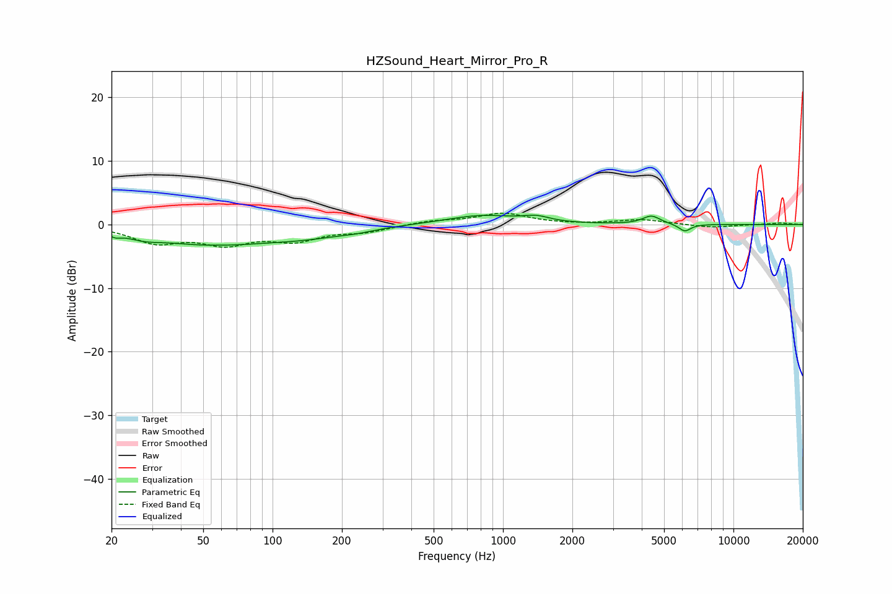

# HZSound_Heart_Mirror_Pro_R
See [usage instructions](https://github.com/jaakkopasanen/AutoEq#usage) for more options and info.

### Parametric EQs
Apply preamp of -1.6 dB when using parametric equalizer.

|   # | Type    |   Fc (Hz) |    Q |   Gain (dB) |
|-----|---------|-----------|------|-------------|
|   1 | Peaking |        21 | 5.95 |        -0.6 |
|   2 | Peaking |        27 | 1.9  |        -0.9 |
|   3 | Peaking |        54 | 0.63 |        -3.2 |
|   4 | Peaking |        57 | 1.12 |         0.5 |
|   5 | Peaking |       140 | 0.77 |        -1.4 |
|   6 | Peaking |       232 | 1.9  |        -0.4 |
|   7 | Peaking |       809 | 0.92 |         1.5 |
|   8 | Peaking |      1396 | 2.57 |         0.8 |
|   9 | Peaking |      4407 | 3.67 |         1.3 |
|  10 | Peaking |      6152 | 5.25 |        -1.2 |

### Fixed Band EQs
When using fixed band (also called graphic) equalizer, apply preamp of **-1.9 dB** (if available) and set gains manually with these parameters.

|   # | Type    |   Fc (Hz) |    Q |   Gain (dB) |
|-----|---------|-----------|------|-------------|
|   1 | Peaking |        31 | 1.41 |        -2.6 |
|   2 | Peaking |        62 | 1.41 |        -2.7 |
|   3 | Peaking |       125 | 1.41 |        -2.2 |
|   4 | Peaking |       250 | 1.41 |        -1   |
|   5 | Peaking |       500 | 1.41 |         0.6 |
|   6 | Peaking |      1000 | 1.41 |         1.7 |
|   7 | Peaking |      2000 | 1.41 |        -0   |
|   8 | Peaking |      4000 | 1.41 |         0.8 |
|   9 | Peaking |      8000 | 1.41 |        -0.5 |
|  10 | Peaking |     16000 | 1.41 |         0.3 |

### Graphs

