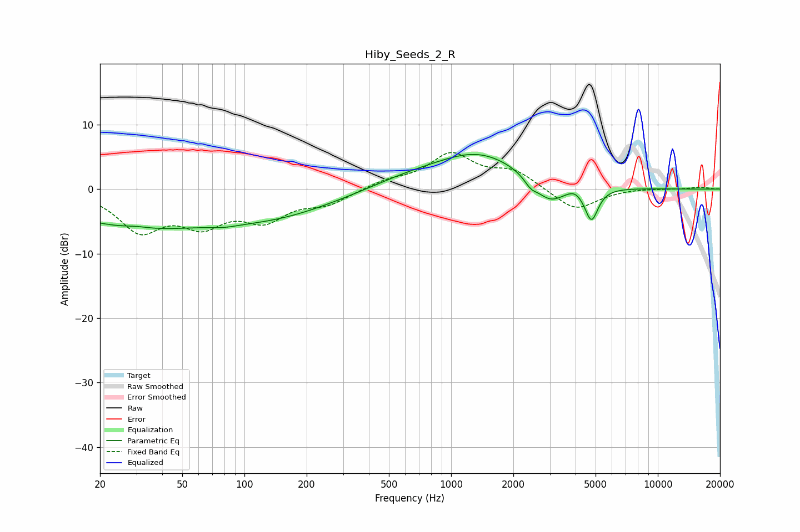

# Hiby_Seeds_2_R
See [usage instructions](https://github.com/jaakkopasanen/AutoEq#usage) for more options and info.

### Parametric EQs
Apply preamp of -5.5 dB when using parametric equalizer.

|   # | Type    |   Fc (Hz) |    Q |   Gain (dB) |
|-----|---------|-----------|------|-------------|
|   1 | Peaking |        29 | 0.39 |        -5.5 |
|   2 | Peaking |        30 | 2.22 |         0.4 |
|   3 | Peaking |        80 | 2.13 |        -0.4 |
|   4 | Peaking |       142 | 0.48 |        -3.6 |
|   5 | Peaking |       609 | 0.73 |         1.2 |
|   6 | Peaking |      1363 | 0.66 |         5.4 |
|   7 | Peaking |      2428 | 4.61 |        -1.2 |
|   8 | Peaking |      3006 | 1.93 |        -3.4 |
|   9 | Peaking |      3961 | 3.93 |         0.7 |
|  10 | Peaking |      4774 | 4.33 |        -5.1 |

### Fixed Band EQs
When using fixed band (also called graphic) equalizer, apply preamp of **-5.8 dB** (if available) and set gains manually with these parameters.

|   # | Type    |   Fc (Hz) |    Q |   Gain (dB) |
|-----|---------|-----------|------|-------------|
|   1 | Peaking |        31 | 1.41 |        -6   |
|   2 | Peaking |        62 | 1.41 |        -4.7 |
|   3 | Peaking |       125 | 1.41 |        -4.2 |
|   4 | Peaking |       250 | 1.41 |        -2   |
|   5 | Peaking |       500 | 1.41 |         1.2 |
|   6 | Peaking |      1000 | 1.41 |         5.2 |
|   7 | Peaking |      2000 | 1.41 |         2.6 |
|   8 | Peaking |      4000 | 1.41 |        -3.4 |
|   9 | Peaking |      8000 | 1.41 |         0.2 |
|  10 | Peaking |     16000 | 1.41 |         0.3 |

### Graphs

