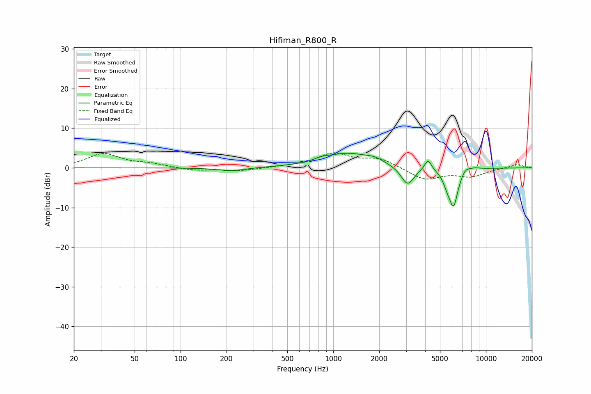

# Hifiman_R800_R
See [usage instructions](https://github.com/jaakkopasanen/AutoEq#usage) for more options and info.

### Parametric EQs
Apply preamp of -3.8 dB when using parametric equalizer.

|   # | Type    |   Fc (Hz) |    Q |   Gain (dB) |
|-----|---------|-----------|------|-------------|
|   1 | Peaking |       216 | 1.62 |        -0.8 |
|   2 | Peaking |       842 | 3.45 |         0.5 |
|   3 | Peaking |      1237 | 0.88 |         3.6 |
|   4 | Peaking |      1871 | 2.55 |         0.9 |
|   5 | Peaking |      3066 | 3.31 |        -4.7 |
|   6 | Peaking |      4177 | 6    |         2.8 |
|   7 | Peaking |      5562 | 5.8  |        -1.9 |
|   8 | Peaking |      6132 | 4.39 |        -9.4 |
|   9 | Peaking |      7315 | 4.32 |         1.4 |
|  10 | Peaking |      8391 | 3.51 |         0.4 |

### Fixed Band EQs
When using fixed band (also called graphic) equalizer, apply preamp of **-3.9 dB** (if available) and set gains manually with these parameters.

|   # | Type    |   Fc (Hz) |    Q |   Gain (dB) |
|-----|---------|-----------|------|-------------|
|   1 | Peaking |        31 | 1.41 |         3.5 |
|   2 | Peaking |        62 | 1.41 |         0.9 |
|   3 | Peaking |       125 | 1.41 |        -0.7 |
|   4 | Peaking |       250 | 1.41 |        -0.7 |
|   5 | Peaking |       500 | 1.41 |         0.2 |
|   6 | Peaking |      1000 | 1.41 |         3.5 |
|   7 | Peaking |      2000 | 1.41 |         2.3 |
|   8 | Peaking |      4000 | 1.41 |        -3   |
|   9 | Peaking |      8000 | 1.41 |        -2   |
|  10 | Peaking |     16000 | 1.41 |         0.9 |

### Graphs

