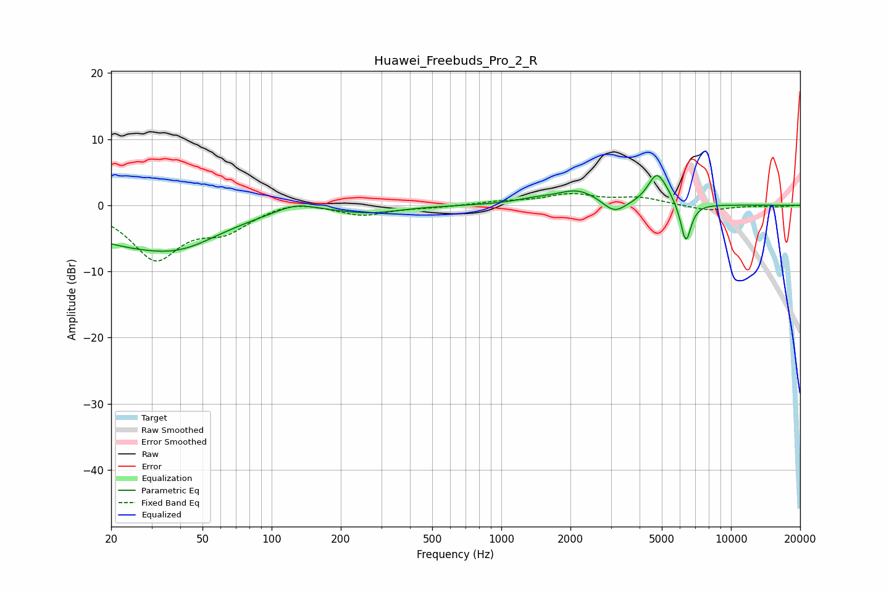

# Huawei_Freebuds_Pro_2_R
See [usage instructions](https://github.com/jaakkopasanen/AutoEq#usage) for more options and info.

### Parametric EQs
Apply preamp of -4.6 dB when using parametric equalizer.

|   # | Type    |   Fc (Hz) |    Q |   Gain (dB) |
|-----|---------|-----------|------|-------------|
|   1 | Peaking |        24 | 0.45 |        -5.1 |
|   2 | Peaking |        41 | 0.87 |        -2.6 |
|   3 | Peaking |       127 | 1.64 |         1.3 |
|   4 | Peaking |       268 | 1.07 |        -1   |
|   5 | Peaking |      1393 | 1.6  |         0.6 |
|   6 | Peaking |      2161 | 1.51 |         2.2 |
|   7 | Peaking |      3106 | 2.78 |        -2   |
|   8 | Peaking |      4732 | 3.63 |         4   |
|   9 | Peaking |      5184 | 3.01 |         1.2 |
|  10 | Peaking |      6362 | 5.92 |        -6.2 |

### Fixed Band EQs
When using fixed band (also called graphic) equalizer, apply preamp of **-1.9 dB** (if available) and set gains manually with these parameters.

|   # | Type    |   Fc (Hz) |    Q |   Gain (dB) |
|-----|---------|-----------|------|-------------|
|   1 | Peaking |        31 | 1.41 |        -7.8 |
|   2 | Peaking |        62 | 1.41 |        -3.3 |
|   3 | Peaking |       125 | 1.41 |         1   |
|   4 | Peaking |       250 | 1.41 |        -1.5 |
|   5 | Peaking |       500 | 1.41 |        -0.3 |
|   6 | Peaking |      1000 | 1.41 |         0.5 |
|   7 | Peaking |      2000 | 1.41 |         1.5 |
|   8 | Peaking |      4000 | 1.41 |         1.1 |
|   9 | Peaking |      8000 | 1.41 |        -0.8 |
|  10 | Peaking |     16000 | 1.41 |        -0.2 |

### Graphs

