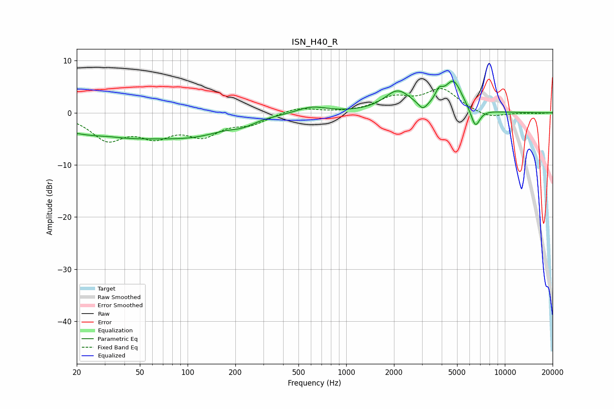

# ISN_H40_R
See [usage instructions](https://github.com/jaakkopasanen/AutoEq#usage) for more options and info.

### Parametric EQs
Apply preamp of -6.1 dB when using parametric equalizer.

|   # | Type    |   Fc (Hz) |    Q |   Gain (dB) |
|-----|---------|-----------|------|-------------|
|   1 | Peaking |        32 | 1.98 |         0.3 |
|   2 | Peaking |        34 | 0.34 |        -4.5 |
|   3 | Peaking |       117 | 0.69 |        -2.4 |
|   4 | Peaking |       223 | 1.95 |        -0.9 |
|   5 | Peaking |       605 | 1.53 |         1.3 |
|   6 | Peaking |      2108 | 1.71 |         4   |
|   7 | Peaking |      3041 | 4.94 |        -1.5 |
|   8 | Peaking |      3847 | 5.99 |         2   |
|   9 | Peaking |      4739 | 2.48 |         5.8 |
|  10 | Peaking |      6514 | 4.62 |        -3.8 |

### Fixed Band EQs
When using fixed band (also called graphic) equalizer, apply preamp of **-4.7 dB** (if available) and set gains manually with these parameters.

|   # | Type    |   Fc (Hz) |    Q |   Gain (dB) |
|-----|---------|-----------|------|-------------|
|   1 | Peaking |        31 | 1.41 |        -4.8 |
|   2 | Peaking |        62 | 1.41 |        -3.7 |
|   3 | Peaking |       125 | 1.41 |        -3.8 |
|   4 | Peaking |       250 | 1.41 |        -1.9 |
|   5 | Peaking |       500 | 1.41 |         1.1 |
|   6 | Peaking |      1000 | 1.41 |        -0.1 |
|   7 | Peaking |      2000 | 1.41 |         2.6 |
|   8 | Peaking |      4000 | 1.41 |         4.3 |
|   9 | Peaking |      8000 | 1.41 |        -1.2 |
|  10 | Peaking |     16000 | 1.41 |        -0.1 |

### Graphs

