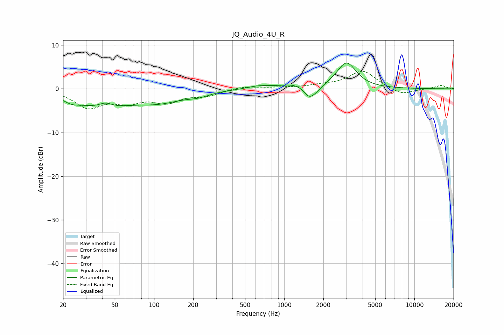

# JQ_Audio_4U_R
See [usage instructions](https://github.com/jaakkopasanen/AutoEq#usage) for more options and info.

### Parametric EQs
Apply preamp of -6.0 dB when using parametric equalizer.

|   # | Type    |   Fc (Hz) |    Q |   Gain (dB) |
|-----|---------|-----------|------|-------------|
|   1 | Peaking |        23 | 1.91 |        -1.6 |
|   2 | Peaking |        41 | 0.89 |        -4.2 |
|   3 | Peaking |        42 | 2.32 |         1.9 |
|   4 | Peaking |       108 | 0.72 |        -2.7 |
|   5 | Peaking |       221 | 1.72 |        -0.8 |
|   6 | Peaking |       630 | 1.8  |         0.6 |
|   7 | Peaking |      1324 | 1.07 |         1.3 |
|   8 | Peaking |      1545 | 3.22 |        -2.6 |
|   9 | Peaking |      1744 | 2.65 |        -1.4 |
|  10 | Peaking |      3013 | 1.91 |         5.9 |

### Fixed Band EQs
When using fixed band (also called graphic) equalizer, apply preamp of **-4.1 dB** (if available) and set gains manually with these parameters.

|   # | Type    |   Fc (Hz) |    Q |   Gain (dB) |
|-----|---------|-----------|------|-------------|
|   1 | Peaking |        31 | 1.41 |        -4   |
|   2 | Peaking |        62 | 1.41 |        -2.6 |
|   3 | Peaking |       125 | 1.41 |        -2.7 |
|   4 | Peaking |       250 | 1.41 |        -1.4 |
|   5 | Peaking |       500 | 1.41 |         0.6 |
|   6 | Peaking |      1000 | 1.41 |         0.2 |
|   7 | Peaking |      2000 | 1.41 |         0.6 |
|   8 | Peaking |      4000 | 1.41 |         4.1 |
|   9 | Peaking |      8000 | 1.41 |        -1.5 |
|  10 | Peaking |     16000 | 1.41 |         0.8 |

### Graphs

