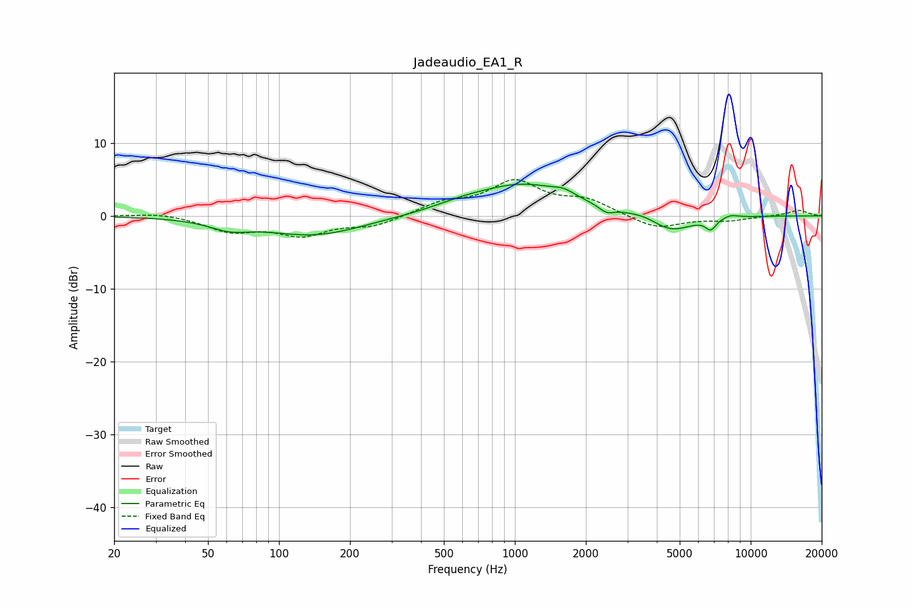

# Jadeaudio_EA1_R
See [usage instructions](https://github.com/jaakkopasanen/AutoEq#usage) for more options and info.

### Parametric EQs
Apply preamp of -4.4 dB when using parametric equalizer.

|   # | Type    |   Fc (Hz) |    Q |   Gain (dB) |
|-----|---------|-----------|------|-------------|
|   1 | Peaking |        62 | 1.68 |        -1.2 |
|   2 | Peaking |       141 | 0.68 |        -2.6 |
|   3 | Peaking |       592 | 1.2  |         0.7 |
|   4 | Peaking |      1088 | 0.69 |         4.2 |
|   5 | Peaking |      1614 | 3.07 |         0.7 |
|   6 | Peaking |      2447 | 4.41 |        -0.9 |
|   7 | Peaking |      3594 | 2.34 |         0.4 |
|   8 | Peaking |      4579 | 1.53 |        -2.3 |
|   9 | Peaking |      6778 | 5.99 |        -1.4 |
|  10 | Peaking |      8224 | 4.1  |         0.4 |

### Fixed Band EQs
When using fixed band (also called graphic) equalizer, apply preamp of **-5.1 dB** (if available) and set gains manually with these parameters.

|   # | Type    |   Fc (Hz) |    Q |   Gain (dB) |
|-----|---------|-----------|------|-------------|
|   1 | Peaking |        31 | 1.41 |         0.5 |
|   2 | Peaking |        62 | 1.41 |        -2   |
|   3 | Peaking |       125 | 1.41 |        -2.4 |
|   4 | Peaking |       250 | 1.41 |        -1.3 |
|   5 | Peaking |       500 | 1.41 |         1.6 |
|   6 | Peaking |      1000 | 1.41 |         4.5 |
|   7 | Peaking |      2000 | 1.41 |         2   |
|   8 | Peaking |      4000 | 1.41 |        -1.8 |
|   9 | Peaking |      8000 | 1.41 |        -0.6 |
|  10 | Peaking |     16000 | 1.41 |         0.8 |

### Graphs

