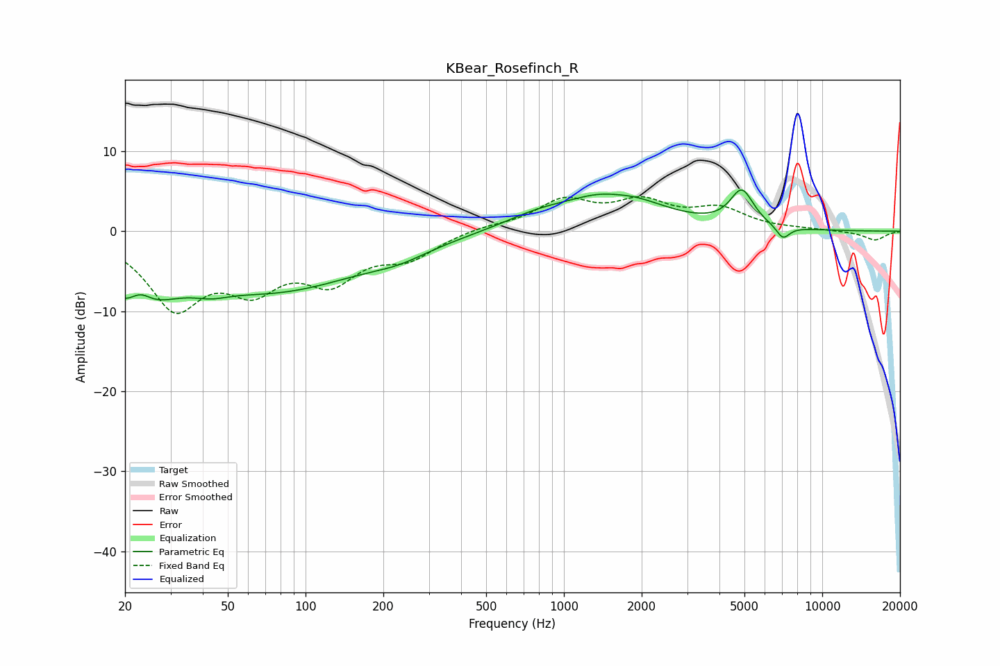

# KBear_Rosefinch_R
See [usage instructions](https://github.com/jaakkopasanen/AutoEq#usage) for more options and info.

### Parametric EQs
Apply preamp of -5.2 dB when using parametric equalizer.

|   # | Type    |   Fc (Hz) |    Q |   Gain (dB) |
|-----|---------|-----------|------|-------------|
|   1 | Peaking |        22 | 1.19 |        -8.3 |
|   2 | Peaking |        23 | 2.88 |         3.3 |
|   3 | Peaking |        43 | 2.11 |        -0.9 |
|   4 | Peaking |        77 | 0.39 |        -7   |
|   5 | Peaking |       230 | 1.29 |        -1   |
|   6 | Peaking |       790 | 1.01 |         1.4 |
|   7 | Peaking |      1577 | 0.82 |         4.7 |
|   8 | Peaking |      1613 | 2.09 |        -0.5 |
|   9 | Peaking |      4884 | 3.06 |         4.5 |
|  10 | Peaking |      7045 | 5.16 |        -1.6 |

### Fixed Band EQs
When using fixed band (also called graphic) equalizer, apply preamp of **-4.4 dB** (if available) and set gains manually with these parameters.

|   # | Type    |   Fc (Hz) |    Q |   Gain (dB) |
|-----|---------|-----------|------|-------------|
|   1 | Peaking |        31 | 1.41 |        -8.9 |
|   2 | Peaking |        62 | 1.41 |        -5.8 |
|   3 | Peaking |       125 | 1.41 |        -5.4 |
|   4 | Peaking |       250 | 1.41 |        -2.9 |
|   5 | Peaking |       500 | 1.41 |         0.6 |
|   6 | Peaking |      1000 | 1.41 |         3.6 |
|   7 | Peaking |      2000 | 1.41 |         3.2 |
|   8 | Peaking |      4000 | 1.41 |         2.5 |
|   9 | Peaking |      8000 | 1.41 |         0.2 |
|  10 | Peaking |     16000 | 1.41 |        -1.1 |

### Graphs

