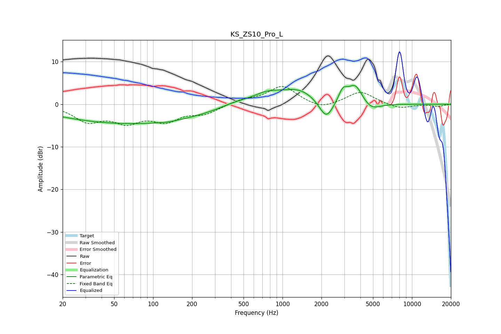

# KS_ZS10_Pro_L
See [usage instructions](https://github.com/jaakkopasanen/AutoEq#usage) for more options and info.

### Parametric EQs
Apply preamp of -4.5 dB when using parametric equalizer.

|   # | Type    |   Fc (Hz) |    Q |   Gain (dB) |
|-----|---------|-----------|------|-------------|
|   1 | Peaking |        60 | 0.26 |        -4.3 |
|   2 | Peaking |       130 | 2.53 |        -0.2 |
|   3 | Peaking |       221 | 0.42 |        -0.6 |
|   4 | Peaking |       432 | 1.12 |         1.1 |
|   5 | Peaking |       757 | 1.3  |         2   |
|   6 | Peaking |      1339 | 1    |         3.3 |
|   7 | Peaking |      2179 | 2.52 |        -4.9 |
|   8 | Peaking |      2928 | 4.16 |         2.8 |
|   9 | Peaking |      3648 | 2.44 |         4.6 |
|  10 | Peaking |      4798 | 2    |        -2   |

### Fixed Band EQs
When using fixed band (also called graphic) equalizer, apply preamp of **-4.3 dB** (if available) and set gains manually with these parameters.

|   # | Type    |   Fc (Hz) |    Q |   Gain (dB) |
|-----|---------|-----------|------|-------------|
|   1 | Peaking |        31 | 1.41 |        -3.7 |
|   2 | Peaking |        62 | 1.41 |        -3.6 |
|   3 | Peaking |       125 | 1.41 |        -3.4 |
|   4 | Peaking |       250 | 1.41 |        -2   |
|   5 | Peaking |       500 | 1.41 |         1   |
|   6 | Peaking |      1000 | 1.41 |         4.3 |
|   7 | Peaking |      2000 | 1.41 |        -1.4 |
|   8 | Peaking |      4000 | 1.41 |         3   |
|   9 | Peaking |      8000 | 1.41 |        -1.1 |
|  10 | Peaking |     16000 | 1.41 |        -0.5 |

### Graphs

